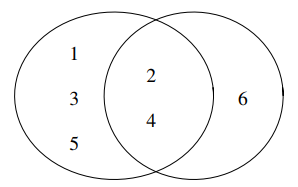

# Sets, Real Numbers and Inequalities

## Sets

### Introduction

**Idea of definition**: A set is a collection of objects.

**Terminology** An object in a set is called an **element** or a member of the set. To describe sets, we can use *listing* or *description*.

**Listing** List all the elements in a set, e.g., $\{1,2,3\}$ is the set containing three elements.

**Description** Describe a common property of the elements of the set, using the
following notation:
$$\{x:P(x)\}~~~\text{or}~~~ \{x|p(x)\}$$ 
read "the set of all $x$ such that $P(x)$ (is true)". 
For example $\{x:x ~~\text{is a positive integer less than 101}\}=\{1,\ldots,100\}=\{x\in\mathbb{R}:x\le100\}$. 

**Notations**

1. The set of all real numbers is denoted by $\mathbb{R}$.

2. The set of all rational numbers is denoted by $\mathbb{Q}$.

3. The set of all integers  is denoted by $\mathbb{Z}$.

4. The set of all positive integers is denoted by $\mathbb{Z}_+$.

5. The set of all all natural numbers is denoted by $\mathbb{N}$.

**Example** $2\in\mathbb{N}, 2\in\mathbb{Q},\pi\in\mathbb{R},\pi\notin\mathbb{Q}$.

**Example** Let $A=\{1,2,\ldots,100\}$ and $B=\{2,3,4,5\}$. Then every element of set $B$ is also an element of set $A$. The equity means assigning a name to a set, i.e., the set $\{1,2,\ldots,100\}$ is denoted by $A$. Sometimes, we use the symbol $:=$. 

**Notation** Given an object $x$ and a set $A$, either $x$ is an element of $A$ denoted by $x\in A$ or $x$ is not an element of $A$ denoted by $x\notin A$.

**Definition** The set that has no element is called **the empty set** denoted by $\emptyset$.

**Definition** Let $A$ and $B$ be sets. If every element of $A$ is also an element of $B$ and vice versa, then we say that $A$ and $B$ are equal, denotedby $A=B$. Otherwise, we say that $A$ and $B$ are unequal, denoted by $A\neq B$.

**Example** Let $A=\{1,3,5,7,9\}$ and let $B=\{x\in\mathbb{Z}_+: x ~~\text{is a prime number less than 10}\}$. Then we have $A\neq B$.

**Example** Let $A=\{1,2,3\}$ and let $B=\{1,3,2\}$. Then we have $A=B$.

**Definition** Let $A$ and $B$ be sets. If every element of $A$ is also an element of $B$, then we say that $A$ is a subset of $B$, denoted by $A\subseteq B$. Otherwise, we say that $A$ is not a subset of $B$, denoted by $A\nsubseteq B$.

**Note**

1. $A\subseteq A$

2. $A=B$ if and only if $A\subseteq B$ and $B\subseteq A$.

3. $A\nsubseteq B$ means that there is at least one element of $A$ that is not an element of $B$.

**Example** Let $A=\{1,2,3,4,5\}$, $B=\{1,3,5\}$, $C=\{2,4,6\}$. 
Then we have $B\subseteq A$ and $C\nsubseteq A$.

```{r,echo=FALSE,out.width="40%",fig.align = 'center'}
knitr::opts_chunk$set(fig.pos = "!H", out.extra = "")

```

### Set operations

**Definition** Let $A$ and $B$ be sets.

1. The **intersection** of $A$ and $B$, denoted by $A\cap B$, is the set whose elements are those belonging to both $A$ and $B$, that is 
$$A\cap B=\{x:x\in A ~~\text{and}~~x\in B\}.$$

2. The **union** of $A$ and $B$, denoted by $A\cup B$, is the set whose elements are those belonging to either $A$ or $B$ or both $A$ and $B$, that is
$$A\cup B=\{x: x\in A ~~\text{or}~~x\in B\}.$$

**Example** Let $A=\{2,3,5\}$, $B=\{2,5,6,8\}$ and $C=\{1,2,3\}$. Find the following sets: $A\cap B$, $A\cup B$, $(A\cap B)\cap C$, $A\cap (B\cap C)$.

**Associative** Set intersection and set union are associative.
$$(A\cap B)\cap C=A\cap(B\cap C)$$
$$(A\cup B)\cup C=A\cup(B\cup C)$$

**Definition** Let $A$ and $B$ be sets. The relative complement of $B$ in $A$, denoted by $A\backslash B$ or $A-B$, is the set whose elements are those belonging to $A$ but not belonging to $B$, that is,
$$A\backslash B=\{x\in A:x\notin B\}.$$

**Example** Let $A=\{a,b,c\}$ and $B=\{c,d,e\}$. Then we have $A\backslash B=\{a,b\}.$

**Universal set** A large enough set containing all objects under consideration, denoted by $U$.

**Example** In considering whole numbers, we may use $\mathbb{Z}$ as a universal set. The set of all prime numbers can be written as $\{x\in\mathbb{Z}:x>0 ~\text{and}~x~ \text{has exactly two divisors} \}$.

**Definition** Let $U$ be a universal set and let $B$ be a subset of $U$. Then the set $U\backslash B$ is called the complement of $B$ (in $U$) and is denoted by $B'$ (or $B^c$).


**Venn Diagrams** A Venn diagram is a device to represent sets graphically.

**Formulas for set operations**

$$(A\cup B)\cap C=(A\cap B)\cup(B\cap C)$$

```{r,echo=FALSE,out.width="70%",fig.align = 'center'}
knitr::opts_chunk$set(fig.pos = "!H", out.extra = "")
knitr::include_graphics("./plots/1/vn2.png")
```


## Real Numbers

### The Number Systems

**Natural numbers** $\mathbb{N}=\{0,1,2,\ldots\}$

**Integers** $\mathbb{Z}=\{\ldots,-2,-1,0,1,2,\ldots\}$

**Rational numbers** $\mathbb{Q}=\{\frac{p}{q}:p,q~~ \text{are integers, and}~~q\neq 0\}.$ $\mathbb{Z}\subseteq\mathbb{Q}.$ 

**Irrational numbers** Numbers that can be represented by non-terminating and non-repeating decimals. For example $\pi$ and $\sqrt{2}$.

**Real numbers** Rational numbers together with irrational numbers are called real numbers, denoted by $\mathbb{R}$.

**Real number line** Real numbers can be represented by points on a line, called the real number line.

```{r,echo=FALSE,out.width="50%",fig.align = 'center'}
knitr::opts_chunk$set(fig.pos = "!H", out.extra = "")
knitr::include_graphics("./plots/1/real_number_line.png")
```

**Intervals** The following types of subsets of $\mathbb{R}$ are called intervals

$$[a,b]=\{x\in\mathbb{R}:a\le x\le b\}$$
$$(a,b)=\{x\in\mathbb{R}:a< x< b\}$$
$$[a,b)=\{x\in\mathbb{R}:a\le x< b\}$$
$$(a,b]=\{x\in\mathbb{R}:a< x\le b\}$$
$$[a,\infty)=\{x\in\mathbb{R}:a\le x\}$$
$$(a,\infty)=\{x\in\mathbb{R}:a< x\}$$
$$(\infty,b]=\{x\in\mathbb{R}:x\le b\}$$
$$(\infty,b)=\{x\in\mathbb{R}:x< b\}$$
$$(-\infty,\infty)=\mathbb{R}$$

**Terminology**

- Bounded intervals: $[a,b],(a,b),(a,b],[a,b)$

- Unbouded intervals: $(-\infty,b),(-\infty,b],(a,\infty),[a,\infty),(-\infty,\infty)$

- Open intervals: $(a,b),(-\infty,b),(a,\infty),(-\infty,\infty)$

- Closed intervals: $[a,b],(\infty,b],[a,\infty),(-\infty,\infty)$

- Closed and bounded intervals: $[a,b]$

- Degenerated interval: An interval containing only one element of $\mathbb{R}$. For example $\{a\}$.

- Empty interval: $\emptyset$.

**Example** $A=[1,5]$ and $B=(3,10]$. Find $A\cap B$ and $A\cup B$.

### Radicals

**Root** Let $a$ and $b$ be real numbers and let $q$ be a positive integer. If $a^q=b$, we say that $a$ is a $q$th root of $b$.

**Example** $-2$ is the cube root of $-8$. $3$ and $-3$ are the square roots of $9$.

**Note** If $q$ is odd, then every real number has a unique $q$th root. If $q$ is even, then 

1. every positive real number has two $q$th roots; 

2. negative real numbers do not have $q$th root; 

3. the $q$th root of $0$ is $0$.

**Principal root** Denoted by $\sqrt[q]{b}$.

1. If $q$ is odd, $\sqrt[q]{b}$ is the $q$th root of $b$.

2. If $q$ is even,

  - If $b>0$, $\sqrt[q]{b}$ is the positive $q$th root of $b$.
  
  - If $b<0$, the principal root is undefined.
  
  - If $b=0$, $\sqrt[q]{b}=0$.
  
**Terminology** The symbol $\sqrt[q]{b}$ is called a radical, in which $q$ is called the index and b the radicand.

**Formula** $b^{\frac{p}{q}}=\sqrt[q]{b^p}$.

## Solving Inequalities

An inequality in one unknown $x$ can be written in one of the following forms:

1. $F(x)>0$

2. $F(x)\geq0$

3. $F(x)<0$

4. $F(x)\le 0$

**Definition** Consider an inequality in the form $F(x)>0$.

1. A real number $x_0$ satisfying $F(x_0)>0$ is caleed a solution to the inequality.

2. The set of all solutions to the inequality is called the solution set to the inequality.

**Polynomial inequalities** have a liking form of $a_nx^n+a_{n-1}x^{n-1}+\cdots+a_0<0$. Note that when $n=1$ it is a linear inequality.

**Example** Find the solution set to $1\le3-2x\le9.$ Find the solution set to $2x+1<3$ and $3x+10<4$.

**Quadratic inequalities** Example: Find the solution set to the inequality $x^2+2x-15>0$.

**Polynomial inequality with degrees $\geq 3$** Example: Factorize the polynomial $p(x)=x^3+3x^2-4x-12$ and find the solution set to $p(x)\le0$.

**Theorem** Let $$p(x)=c_nx^n+c_{n-1}x^{n-1}+\cdots+c_1x+c_0$$ be a polynomial of degree $n$ where $c_0,c_1,\ldots,c_n\in\mathbb{Z}$. Suppose $(ax-b)$ is a factor of $p(x)$ where $a,b\in\mathbb{Z}$. Then $a$ divides $c_n$ and $b$ divides $c_0$.


