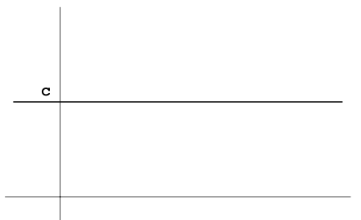
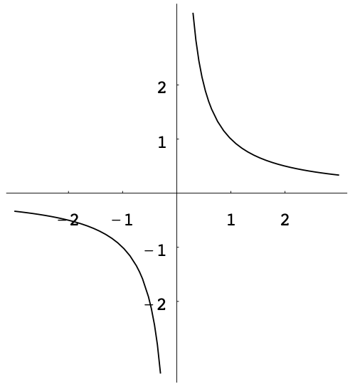
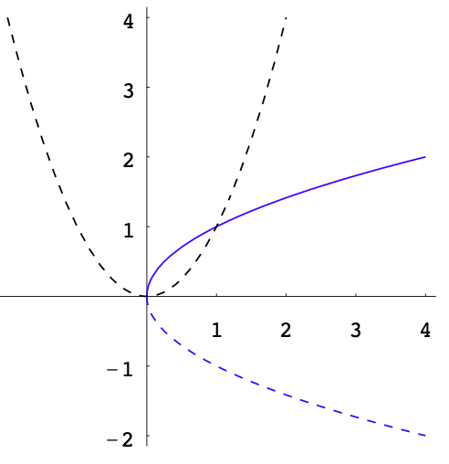
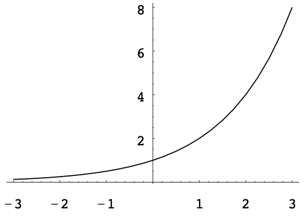
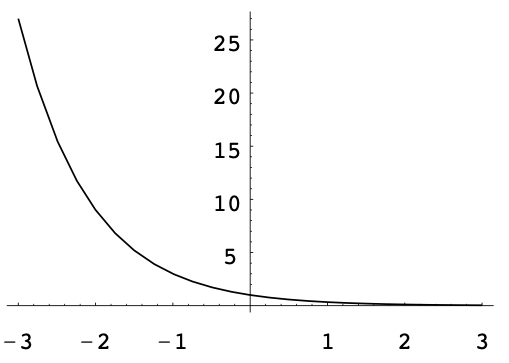

# More Functions and Graphs

## Functions

**Informal definition** Let $A$ and $B$ be sets. A function from $A$ to $B$, denoted by $f:A\rightarrowB$, is a rule that assigns to each element of $A$ exactly one element of $B$.

**Terminology** The sets $A$ and $B$ are called the domain and codomain of $f$, respectively. The domain is denoted by $\text{dom}(f)$.

**Terminology** For each $x$ in $A$, the corresponding element assigned by $f$ is denoted by $f(x)$ and is called the **image** of $x$ under $f$.

**Terminology** The input variable for a function is called an independent variable. The output variable is called a dependent variable because its value depends on the value of the independent variable.

**Example** $f:\mathbb{R}\rightarrow\mathbb{R},~x\mapsto f(x)=x^2+2$.

## Domains and Ranges

**Natural domain** The natural domain of $f$ is the set of all real numbers $x$ such that $f(x)$ is defined.

**Example** Find the (natural) domains of the following functions:

1. $g(x)=\frac{1}{x-2}$

2. $h(x)=\sqrt{1+5x}$

**Definition** Let $f:A\rightarrow B$ be a function and let $S\subseteq A$. The image of $S$ under $f$, denoted by $f[S]$, is the subset of $B$ given by the subset of $B$ consisting of all the images under $f$ of elements in $S$:
$$f[S]=\{y\in B:y=f(x)~~\text{for some}~~x\in S\}.$$

**Example** Let $f:\mathbb{R}\rightarrow\mathbb{R}, x\mapsto f(x)=x^2$. For $S=\{1,2,3\}$, we have $f[S]=\{1,4,9\}$.

**Definition** Let $f:A\rightarrow B$ be a function. The range of $f$, denoted by $\text{ran}(f)$, is the image of $A$ under $f$, that is, $\text{ran}(f)=f[A]$.

**Example** Let $f:\mathbb{R}\rightarrow\mathbb{R}, x\mapsto f(x)=x^2+2$. Then $3$ and $2$ belongs to the range of $f$ but $1$ does not belong to the range of $f$.

**Steps to find range of function**

1. Put $y=f(x)$.

2. Solve $x$ in terms of $y$.

3. The range of $f$ is the set of all real numbers $y$ such that $x$ can be solved.

**Example** Find the ranges of the following functions:

1. $f(x)=x^2+2$

2. $g(x)=\frac{1}{x-2}$

3. $h(x)=\sqrt{1+5x}$

4. $l(x)=\frac{2x+1}{x^2+1}$

## Graphs of Equations

**Ordered pair of real numbers** An ordered pair of real numbers represents a point in the coordinate plane.
The set of all ordered pairs $(x_0,y_0)$ is denoted by $\mathbb{R}^2$, i.e., $(x_0,y_0)\in\mathbb{R}^2$.
So the plane is also denoted by $\mathbb{R}^2$.

**Functions of two variables** $f:A\rightarrow\mathbb{R},(x,y)\in A\mapsto f((x,y))\in\mathbb{R}$, where $A\subseteq\mathbb{R}^2$. Note that $f((x,y))$ is normally simplified as $f(x,y)$.

**Example** $f:\mathbb{R}^2\rightarrow\mathbb{R}, (x,y)\mapsto f(x,y)=x+y^2.$

**Graph of a function** Let $F$ be a function of two variables $(x,y)\in\mathbb{R}^2\mapsto F(x,y)\in\mathbb{R}$. Consider an equation in the form of $F(x,y)=0$. The set of all ordered pairs $(x,y)$ satisfying $F(x,y)=0$ is called the graph of the equation $F(x,y)=0$, i.e., it is a subset of the plane $\mathbb{R}^2$:
$$\{(x,y)\in\mathbb{R}^2:F(x,y)=0\}.$$

**Definition** An $x$-intercept ($y$-intercept) of the graph of an equation $F(x,y)=0$ is a point where the graph intersects the $x$-axis ($y$-axis).

**Example** The graph of equation $x^2+y^2=1$ is a circle with two $x$-intercepts $(1,0),(-1,0)$ and two $y$-intercepts $(0,1),(0,-1)$.

**Symmetry** Consider the graph of the equation $y=x^2$. The graph is a parabola. If $(a,b)$ is a point belonging to the parabola, then $(-a,b)$ also belongs to the parabola since $b=(-a)^2$. We say that the parabola is symmetric about the $y$-axis.

```{r,echo=FALSE,out.width="30%",fig.align = 'center'}
knitr::opts_chunk$set(fig.pos = "!H", out.extra = "")
knitr::include_graphics("./plots/2/parabola.png")
```

**Symmetry** In general, a subset $\mathcal{A}$ of the plane $\mathbb{R}^2$ is said to be symmetric about a line $\mathcal{L}$ if the following condition is satisfied: For any point $P$ belonging to $\mathcal{A}$, there is a point $Q$ belonging to $\mathcal{A}$ such that

1. the line segment $PQ$ is perpendicular to $\mathcal{L}$;

2. $P$ and $Q$ are equidistant from $\mathcal{L}$.

## Graphs of Functions

Let $f:A\rightarrow \mathbb{R}$ be a function where $A\subseteq \mathbb{R}$. The graph of $f$ is the following subset of $\mathbb{R}^2$:
$$\{(x,y)\in\mathbb{R}^2:x\in A~~\text{and}~~y=f(x)\}.$$

1. Constant functions $f(x)=c$. The domain is $\mathbb{R}$. The range is a singleton $\{c\}$.
```{r,echo=FALSE,out.width="30%",fig.align = 'center',fig.cap="constant function"}
knitr::opts_chunk$set(fig.pos = "!H", out.extra = "")

```


2. Linear functions $f(x)=ax+b$. The domain is $\mathbb{R}$. The range is $\mathbb{R}$.
```{r,echo=FALSE,out.width="30%",fig.align = 'center',fig.cap="linear function"}
knitr::opts_chunk$set(fig.pos = "!H", out.extra = "")
knitr::include_graphics("./plots/2/line.png")
```

3. Quadratic functions $f(x)=ax^2+bx+c$. The domain is $\mathbb{R}$. The range is $[k,\infty)$ if $a>0$ and $(-\infty,k]$ if $a<0$, where $k$ is the $y$-coordinate of the vertex.
```{r,echo=FALSE,out.width="60%",fig.align = 'center',fig.cap="quadratic function"}
knitr::opts_chunk$set(fig.pos = "!H", out.extra = "")
knitr::include_graphics("./plots/2/quadratic.png")
```


4. Polynomial functions with degree $n$ $f(x)=a_nx^n+a_{n-1}x^{n-1}+\cdots+a_1x+a_0$.
The domain is $\mathbb{R}$. There are three possibilities for the range.

    1. If the degree $n$ is odd, then $\text{ran}(f)=\mathbb{R}$.

    2. If the degree $n$ is even and positive, then

      - If $a_n>0$ $\text{ran}(f)=[k,\infty)$;
  
      - If $a_n<0$ $\text{ran}(f)=(\infty,k]$.
    
**Example** $f(x)=x^3-3x^2+x-1.$
```{r,echo=FALSE,out.width="40%",fig.align = 'center',fig.cap="quadratic function"}
knitr::opts_chunk$set(fig.pos = "!H", out.extra = "")
knitr::include_graphics("./plots/2/polynomial.png")
```
  
5. Rational functions are in the form of 
$$f(x)=\frac{p(x)}{q(x)},$$
where $p$ and $q$ are polynomial functions.

**Example** $f(x)=\frac{1}{x}$. 
The domain of $f$ is $\mathbb{R}\backslash \{0\}$. 
The range of $f$ is also $\mathbb{R}\backslash \{0\}$. 
The graph of it is symmetric about the origin because $f(-x)=-f(x)$.
```{r,echo=FALSE,out.width="40%",fig.align = 'center',fig.cap="quadratic function"}
knitr::opts_chunk$set(fig.pos = "!H", out.extra = "")

```

6. Principle-square-root function. Denoted by sqrt or $\sqrt$. Given by $\text{sqrt}(x)=\sqrt{x}$. The domain is $[0,\infty)$. The range is $[0,\infty)$.
```{r,echo=FALSE,out.width="40%",fig.align = 'center',fig.cap="quadratic function"}
knitr::opts_chunk$set(fig.pos = "!H", out.extra = "")

```

**Example** For each of the following equations, sketch its graph.

    1. $y=\sqrt{x}-2$
```{r,echo=FALSE,out.width="40%",fig.align = 'center',fig.cap="quadratic function"}
knitr::opts_chunk$set(fig.pos = "!H", out.extra = "")
knitr::include_graphics("./plots/2/sqrt2.png")
```
  
    2. $y=\sqrt{x-2}$
```{r,echo=FALSE,out.width="40%",fig.align = 'center',fig.cap="quadratic function"}
knitr::opts_chunk$set(fig.pos = "!H", out.extra = "")
knitr::include_graphics("./plots/2/sqrt3.png")
```
    
    3. $y=\sqrt{2-x}$
```{r,echo=FALSE,out.width="40%",fig.align = 'center',fig.cap="quadratic function"}
knitr::opts_chunk$set(fig.pos = "!H", out.extra = "")
knitr::include_graphics("./plots/2/sqrt4.png")
```

**Remark** Let $a$ be a positive constant.

- The graph of $y=f(x)+a$ can be obtained from that of $y=f(x)$ by moving it $a$ units up.

- The graph of $y=f(x)-a$ can be obtained from that of $y=f(x)$ by moving it $a$ units down

- The graph of $y=f(x+a)$ can be obtained from that of $y=f(x)$ by moving it $a$ units to the left.

- The graph of $y=f(x-a)$ can be obtained from that of $y=f(x)$ by moving it $a$ units to the right.

- The graph of $y=\sqrt{2-x}$ and that of $y=\sqrt{x-2}$ are symmetric w.r.t.  the vertical line $x=2$.

7. Exponential functions with base $b$ is given by $$\exp_b(x)=b^x$$. The domain is $\mathbb{R}$. The range is $(0,\infty)$. The $y$-intercept of the graph of every exponential function is $(0,1)$.

**Example** The graph of $\exp_2$ goes up and the rate that the graph goes up increases as $x$ increases.
```{r,echo=FALSE,out.width="40%",fig.align = 'center',fig.cap="quadratic function"}
knitr::opts_chunk$set(fig.pos = "!H", out.extra = "")

```

**Example** The graph of $\exp_{\frac{1}{3}}$ goes down as $x$ increases.
```{r,echo=FALSE,out.width="40%",fig.align = 'center',fig.cap="quadratic function"}
knitr::opts_chunk$set(fig.pos = "!H", out.extra = "")

```

8. Logarithmic functions. The function, denoted by $\log$, is called the common logarithmic function. 
For each positive real number $x$, $\log(x)$ is defined to be the unique real number such that $10^{\log (x)}=x$.
That is, $\log(x)=y$ if and only if $y=10^x$.
The domain of log is $(0,\infty)$. The range is $\mathbb{R}$.
```{r,echo=FALSE,out.width="40%",fig.align = 'center',fig.cap="quadratic function"}
knitr::opts_chunk$set(fig.pos = "!H", out.extra = "")
knitr::include_graphics("./plots/2/log.png")
```

<!-- 9. Trigonometric functions -->

9. Absolute value function, denoted by $|\cdot|$, is the function from $\mathbb{R}$ to $\mathbb{R}$, given by 
\begin{equation}
|x|=
\begin{cases}
x~~&\text{if}~~ x>0,\\
0~~&\text{if}~~ x=0,\\
-x~~&\text{if}~~x<0.
\end{cases}
\end{equation}

In defining $|x|$, the domain $\mathbb{R}$ is divided into three disjoint subsets, namely $(0,\infty)$, $\{0\}$ and $(-\infty,0)$.
Functions defined in this way are called **piecewise-defined functions**.
```{r,echo=FALSE,out.width="40%",fig.align = 'center',fig.cap="quadratic function"}
knitr::opts_chunk$set(fig.pos = "!H", out.extra = "")
knitr::include_graphics("./plots/2/abs.png")
```

10. Piecewise-defined functions


## Compositions of Functions

## Inverse Functions

## More on Solving Equations


