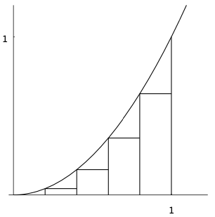

# Limits

Both concepts of differentiation and integration are based on the idea of limit.

## Introduction

**Problem 1** Suppose an object moves along the $x$-axis and its displacement $s$ in meters  at time $t$ in seconds is given by $$s(t)=t^2,~~~t\geq 0.$$
Find its velocity at time $t=2$.

*Solution* Velocity (or speed) is defined by 
$$\text{velocity}=\frac{\text{distance traveled}}{\text{time elapsed}}$$

| $n$ | Time interval | Velocity|
|:--:|:------------: |:-------:|
|$1$|$[2,2.5]$|$4.5$ m/s|
|$2$|$[2,2.25]$|$4.25$ m/s|
|...|...|...|
|$n$|$[2,2+\frac{1}{2^n}]$|$4+\frac{1}{2^n}$ m/s|

**Problem 2** Find the area of the region that lies under the curve $y=x^2$ and above the $x$-axis for $x$ between $0$ and $1$.

*Solution*
```{r,echo=FALSE,out.width="40%",fig.align = 'center',fig.cap="Area under the curve"}
knitr::opts_chunk$set(fig.pos = "!H", out.extra = "")

```
\begin{equation}
\begin{aligned}
S_n&=\frac{1}{n}\cdot 0+\frac{1}{n}\cdot\left(\frac{1}{n}\right)^2+\frac{1}{n}\cdot\left(\frac{2}{n}\right)^2+\ldots+\frac{1}{n}\cdot\left(\frac{n-1}{n}\right)^2 \\
&=\frac{1}{3}-\frac{1}{2n}+\frac{1}{6n^2}
\end{aligned}
\end{equation}

## Limits of Sequences

**Definition**

- A sequence is a function whose domain is $\mathbb{Z}_+$.

- A sequence of real numbers is a sequence whose codomain is $
\mathbb{R}$.

**Illustration** Let $f:~ \mathbb{Z}_+\rightarrow \mathbb{R}$ be a sequence. For each 

## Limits of Functions at Infinity

## One-sided Limits

## Two-sided Limits

## Continunous Functions


