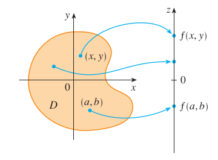
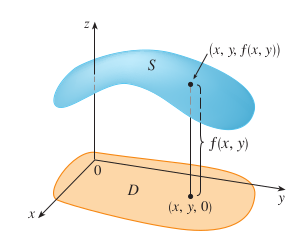
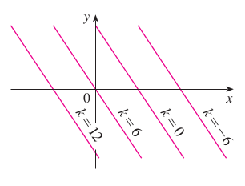
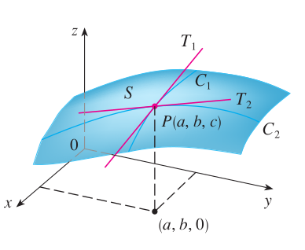

# Partial Differentiation

Note that *an italic title* indicates an application section which is less important than a theoretical one.

## Notes{-}

**Definition** A function $f$ of two variables is a rule that assigns to each ordered pair of real numbers $(x,y)$ in a set $D$ a unique real number denoted by $f(x,y)$. The set $D$ is the domain of $f$ and its range is the set of values that $f$ takes on, that is $\{f(x,y):(x,y)\in D\}$.

**Remark** We often write $z=f(x,y)$ to make explicit the value taken on by $f$ at the general point $(x,y)$. The values $x$ and $y$ are independent variables and $z$ is the dependent variable.

```{r,echo=FALSE,out.width="30%",fig.align = 'center'}
knitr::opts_chunk$set(fig.pos = "!H", out.extra = "")

```

**Definition** If $f$ is a function of two variables with domain $D$, then the graph of $f$ is the set of all points $(x,y,z)\in \mathbb{R}^3$ such that $z=f(x,y)$ and $(x,y) \in D$.

```{r,echo=FALSE,out.width="30%",fig.align = 'center'}
knitr::opts_chunk$set(fig.pos = "!H", out.extra = "")

```

**Remark** Just as the graph of a function $f$ of one variable is a curve $C$ with equation $y=f(x)$, so the graph of a function f of two variables is a surface $S$ with equation $z=f(x,y)$. We can visualize the graph $S$ of $f$ as lying directly above or below its domain $D$ in the $xy$-plane.

**Example** The graph of the **linear function** $f(x,y)=6-3x-2y.$

```{r,echo=FALSE,out.width="30%",fig.align = 'center'}
knitr::opts_chunk$set(fig.pos = "!H", out.extra = "")
knitr::include_graphics("./plots/5/example1.png")
```

**Definition** The **level curves** of a function $f$ of two variables are curves with equations $f(x,y)=k$, where $k$ is a constant (in the range of $f$).

**Remark** A level curve $f(x,y)=k$ is the set of all points in the domain of $f$ at which $f$ takes on a given value $k$. In other words, it shows where the graph of $f$ has height $k$.

```{r,echo=FALSE,out.width="30%",fig.align = 'center'}
knitr::opts_chunk$set(fig.pos = "!H", out.extra = "")
knitr::include_graphics("./plots/5/contour.png")
```

**Example** Topographic maps of mountainous regions. 

```{r,echo=FALSE,out.width="30%",fig.align = 'center'}
knitr::opts_chunk$set(fig.pos = "!H", out.extra = "")

```

**Example** The level curves of the $f(x,y)=6-3x-2y.$

```{r,echo=FALSE,out.width="30%",fig.align = 'center'}
knitr::opts_chunk$set(fig.pos = "!H", out.extra = "")

```

**Definition** Let $f$ be a function of two variables whose domain $D$ includes points arbitrarily close to $(a,b)$. Then we say that the limit of $f(x,y)$ as $(x,y)$ approaches $(a,b)$ is $L$ and we write
$$\underset{(x,y)\rightarrow(a,b)}{\lim}f(x,y)=L$$
if for every number $\epsilon>0$ there is a corresponding number $\delta>0$ such that
if $(x,y)\in D$ and $0<\sqrt{(x-a)^2+(y-b)^2}<\delta$ then $|f(x,y)-L|<\epsilon$.
```{r,echo=FALSE,out.width="30%",fig.align = 'center'}
knitr::opts_chunk$set(fig.pos = "!H", out.extra = "")
knitr::include_graphics("./plots/5/limit.png")
```

**Definition** A **polynomial function** of two variables is a sum of terms of the form $cx^my^n$, where $c$ is a constant and $m$ and $n$ are non-negative integers. A  **rational function** is a ratio of polynomials.

**Definition** Let $f$ is a function of two variables $x$ and $y$. Suppose we let only $x$ vary while keeping $y$ fixed $y=b$, namely, $g(x)=f(x,b)$. If $g$ has a derivative at $a$, then we call it the **partial derivative of $f$ with respect to $x$ at $(a,b)$** and denote it by $f_x(a,b)$.

**Remarks** $$f_x(a,b)=g'(a)=\underset{h\rightarrow 0}{\lim}\frac{g(a+h)-g(a)}{h}$$

$$f_x(a,b)=\underset{h\rightarrow 0}{\lim}\frac{f(a+h,b)-f(a,b)}{h}$$

**Notations** If $f$ is a function of two variables, its partial derivatives are functions $f_x$ and $f_y$ defined by 
$$f_x(x,y)=\underset{h\rightarrow 0}{\lim}\frac{f(x+h,y)-f(x,y)}{h}$$
$$f_y(x,y)=\underset{h\rightarrow 0}{\lim}\frac{f(x,y+h)-f(x,y)}{h}$$
$$f_x(x,y)=f_x=\frac{\partial f}{\partial x}=\frac{\partial}{\partial x}f(x,y)=\frac{\partial z}{\partial x}=f_1=D_1f=D_xf$$

$$f_y(x,y)=f_y=\frac{\partial f}{\partial y}=\frac{\partial}{\partial y}f(x,y)=\frac{\partial z}{\partial y}=f_2=D_2f=D_yf$$

**Rules** for finding partial derivatives of $z=f(x,y)$. To find $f_x$, regard $y$ as a constant and differentiate $f(x,y)$ with respect to $x$.

**Interpretations** If $f(a,b)=c$, then the point $P(a,b,c)$ lies on $S$.
$C_1$ is the trace of $S$ in the plane $y=b$, and it is the graph of the function $g(x)=f(x,b)$. The slope of its tangent $T_1$ at $P(a,b,c)$ is $g'(a)=f_x(a,b)$. The partial derivatives $f_x(a,b)$ and $f_y(a,b)$ can be interpreted geometrically as the slopes of the tangent lines at $P(a,b,c)$ to the traces $C_1$ and $C_2$ of $S$ in the planes $y=b$ and $x=a$.
$\partial z/\partial x$ represent the rate of change of $z$ w.r.t. $x$ when $y$ is fixed.

```{r,echo=FALSE,out.width="30%",fig.align = 'center'}
knitr::opts_chunk$set(fig.pos = "!H", out.extra = "")

```

**Example** If $f(x,y)=4-x^2-2y^2$, find $f_x(1,1)$ and $f_y(1,1)$.
```{r,echo=FALSE,out.width="60%",fig.align = 'center'}
knitr::opts_chunk$set(fig.pos = "!H", out.extra = "")
knitr::include_graphics("./plots/5/example2新.png")
```

**Clairaut's Theorem** Suppose $f$ is defined on a region $D$ that contains the point $(a,b)$. If the functions $f_{xy}$ and $f_{yx}$ are both continuous on $D$, then $$f_{xy}(a,b)=f_{yx}(a,b).$$ 


## Functions of several variables

**Dependent variable** A variable whose value is determined by that taken by the independent variable; in $z=f(x,y)$ the dependent variable is $z$.

**Independent variable** Variables whose values determine that of the dependent variable; in $z=f(x,y)$ the independent variable are $x,y$.

**Partial derivative** The derivative of a function of two or more variables with respect to one of these variables, the others being regarded as constant.

$$f_x=\frac{\partial z}{\partial x}, f_y=\frac{\partial z}{\partial y}$$

**Second-order partial derivative** The partial derivative of a first-order partial derivative. For example, $f_{xy}$ is the second-order partial derivative when $f$ is differentiated with respect to $y$ and then with respect to $x$.

$$f_{xy}=\frac{\partial\frac{\partial z}{x}}{\partial y}$$

**Differentials** Limiting values of incremental changes. In the limit the approximation $\Delta z \approx \partial z/\partial x\times\Delta x$ becomes $d z =\partial z/\partial x\times dx$ where $dz,dx$ are the differentials.

**Small increments formula** $\Delta z\approx \frac{\partial z}{\partial x}\Delta x + \frac{\partial z}{\partial y} \Delta y$

**Implicit differentiation** The process of obtaining $dy/dx$ where the function is not given explicitly as an expression for $y$ in terms of $x$.

## *Partial elasticity and marginal functions*

### *Elasticity* {-}

**Own price elasticity of demand** The responsiveness of demand for one good due to change in the price of itself.

**Cross-price elasticity of demand** The responsiveness of demand for one good due to change in the price of the alternative good.

**Income elasticity of demand** The responsiveness of demand for one good due to a change in income.

**Substitutable good** A pair of goods that are alternatives to each other. As the price of one good goes up, the demand for the other rises.

**Complementary good** A pair of goods consumed together. As the price of either goes up, the demand for both goods goes down.

**Inferior good** A good whose demand decreases as income increases.

**Normal good** A good whose demand increases as income increases.

**Superior good** A normal good for which the percentage rise in consumption exceeds the percentage increases in income.

### *Utility* {-}

**Utility** The satisfaction gained from the consumption of a good.

**Marginal utility** The extra satisfaction gained by consuming 1 extra unit of a good. $\partial U/\partial x_i$.

**Law of diminishing marginal utility** The law which states that the increase in utility due to the consumption of an additional good will eventually decline. $\partial^2 U/\partial x_i^2<0$ for sufficiently large $x_i$.

**Indifference curve** A curve indicating all combinations of two goods which give the same level of utility.

**Indifference map** A diagram showing the graphs of a set of indifference curves. The further the curve is from the origin, the greater the level of utility.

**Marginal rate of commodity substitution** The amount by which one input $x_2$ needs to increase to maintain a constant value of utility when the other input $x_1$ decreases by 1 unit. $MRCS=\frac{\partial U/\partial x_1}{\partial U /\partial x_2}$

### *Production* {-}

**Marginal product of capital** The additional output produced by one unit increase in capital. $MP_k=\frac{\partial Q}{\partial K}$

**Marginal product of labour** The additional ouput produced by one unit increase in labour. $MP_L=\frac{\partial Q}{\partial L}$

**Isoquants** A curve indicating all combinations of two factors which give the same level of output.

**Marginal rate of technical substitution** The amount by which capital needs to rise to maintain a constant level of output when labour decreases by 1 unit. $MRTS=\frac{MP_L}{MP_K}$

**Homogeneous function** A function with the property that when all of the inputs are multiplied by a constant, $\lambda$, the output is multiplied by $\lambda^n$ where $n$ is the degree of homogeneity.

**Euler's theorem** If each inputs is paid the value of its marginal product, the total cost of these inputs is equal to total output, provided there are constant returns to scale.

## *Comparative statics*

*This section is not examinable.*

## Unconstrained optimization

**Routine**

1. Solve the simultaneous equations to find the stationary points

$$
\begin{cases}
f_x(x,y)=0\\
f_y(x,y)=0
\end{cases}
$$

2. Classify the stationary points

   - Minimum point if  $f_{xx}>0,f_{yy}>0, f_{xx}f_{yy}-f_{xy}^2>0$

   - Maximum point if $f_{xx}<0,f_{yy}<0, f_{xx}f_{yy}-f_{xy}^2>0$

   - Saddle point if $f_{xx}f_{yy}-f_{xy}^2<0$

**Saddle point**: A stationary point which is neither a maximum or minimum and at which the surface looks like the middle of a horse’s saddle.

**Maximum point** (of a function of two variables): A point on a surface which has the highest function value in comparison with other values in its neighborhood; at such a point the surface looks like the top of a mountain.

**Minimum point** (of a function of two variables): A point on a surface which has the lowest function value in comparison with other values in its neighborhood; at such a point the surface looks like the bottom of a valley or bowl.

## Constrained optimization

**Objective function**: A function that one seeks to optimize (usually) subject to constraints.

**Method of substitution**: The method of solving constrained optimization problems whereby the constraint is used to eliminate one of the variables in the objective function.

### *Constrained optimization of economic functions* {-}

**Isocost curve**: A line showing all combinations of two factors which can be bought for a fixed cost.

When the **production is maximized**, we have the ratio of marginal product to price is the same for all inputs.
$\frac{MP_L}{P_L}=\frac{MP_K}{P_K}$

When the **utility is maximized**, we have the ratio of marginal utility to price is the same for all goods consumed.
$\frac{U_1}{P_1}=\frac{U_2}{P_2}$

## Lagrange multipliers

**Lagrangian** The function $f(x, y) + \lambda[M − \phi(x, y)]$, where $f(x, y)$ is the objective function and $\phi(x, y) = M$ is the constraint. The stationary point of this function is the solution of the associated constrained optimization problem.

**Lagrange multiplier**: The number $\lambda$ which is used in the Lagrangian function. In economics this gives the approximate change in the optimal value of the objective function when the value of the constraint is increased by $1$ unit.


  
  


