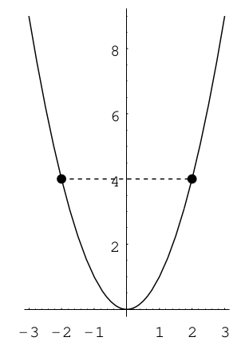
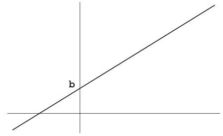
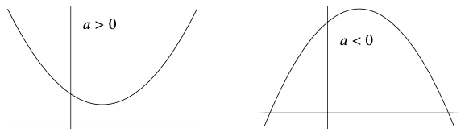
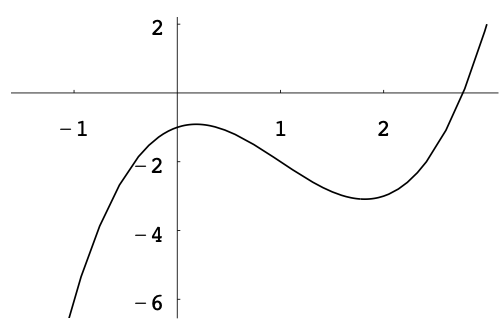
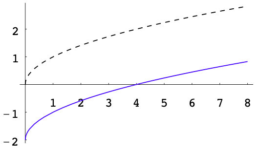
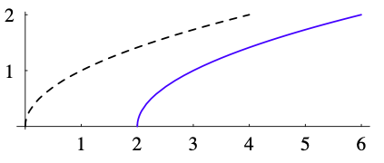
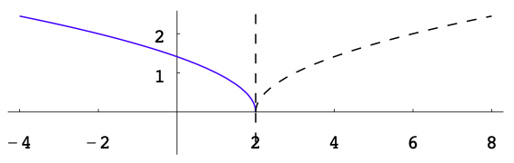
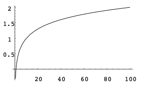
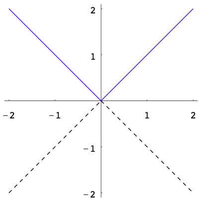
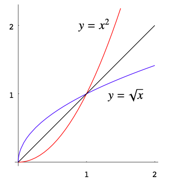

# More Functions and Graphs

## Functions

**Informal definition** Let $A$ and $B$ be sets. A function from $A$ to $B$, denoted by $f:A\rightarrowB$, is a rule that assigns to each element of $A$ exactly one element of $B$.

**Terminology** The sets $A$ and $B$ are called the domain and codomain of $f$, respectively. The domain is denoted by $\text{dom}(f)$.

**Terminology** For each $x$ in $A$, the corresponding element assigned by $f$ is denoted by $f(x)$ and is called the **image** of $x$ under $f$.

**Terminology** The input variable for a function is called an independent variable. The output variable is called a dependent variable because its value depends on the value of the independent variable.

**Example** $f:\mathbb{R}\rightarrow\mathbb{R},~x\mapsto f(x)=x^2+2$.

## Domains and Ranges

**Natural domain** The natural domain of $f$ is the set of all real numbers $x$ such that $f(x)$ is defined.

**Example** Find the (natural) domains of the following functions:

1. $g(x)=\frac{1}{x-2}$

2. $h(x)=\sqrt{1+5x}$

**Definition** Let $f:A\rightarrow B$ be a function and let $S\subseteq A$. The image of $S$ under $f$, denoted by $f[S]$, is the subset of $B$ given by the subset of $B$ consisting of all the images under $f$ of elements in $S$:
$$f[S]=\{y\in B:y=f(x)~~\text{for some}~~x\in S\}.$$

**Example** Let $f:\mathbb{R}\rightarrow\mathbb{R}, x\mapsto f(x)=x^2$. For $S=\{1,2,3\}$, we have $f[S]=\{1,4,9\}$.

**Definition** Let $f:A\rightarrow B$ be a function. The range of $f$, denoted by $\text{ran}(f)$, is the image of $A$ under $f$, that is, $\text{ran}(f)=f[A]$.

**Example** Let $f:\mathbb{R}\rightarrow\mathbb{R}, x\mapsto f(x)=x^2+2$. Then $3$ and $2$ belongs to the range of $f$ but $1$ does not belong to the range of $f$.

**Steps to find range of function**

1. Put $y=f(x)$.

2. Solve $x$ in terms of $y$.

3. The range of $f$ is the set of all real numbers $y$ such that $x$ can be solved.

**Example** Find the ranges of the following functions:

1. $f(x)=x^2+2$

2. $g(x)=\frac{1}{x-2}$

3. $h(x)=\sqrt{1+5x}$

4. $l(x)=\frac{2x+1}{x^2+1}$

## Graphs of Equations

**Ordered pair of real numbers** An ordered pair of real numbers represents a point in the coordinate plane.
The set of all ordered pairs $(x_0,y_0)$ is denoted by $\mathbb{R}^2$, i.e., $(x_0,y_0)\in\mathbb{R}^2$.
So the plane is also denoted by $\mathbb{R}^2$.

**Functions of two variables** $f:A\rightarrow\mathbb{R},(x,y)\in A\mapsto f((x,y))\in\mathbb{R}$, where $A\subseteq\mathbb{R}^2$. Note that $f((x,y))$ is normally simplified as $f(x,y)$.

**Example** $f:\mathbb{R}^2\rightarrow\mathbb{R}, (x,y)\mapsto f(x,y)=x+y^2.$

**Graph of a function** Let $F$ be a function of two variables $(x,y)\in\mathbb{R}^2\mapsto F(x,y)\in\mathbb{R}$. Consider an equation in the form of $F(x,y)=0$. The set of all ordered pairs $(x,y)$ satisfying $F(x,y)=0$ is called the graph of the equation $F(x,y)=0$, i.e., it is a subset of the plane $\mathbb{R}^2$:
$$\{(x,y)\in\mathbb{R}^2:F(x,y)=0\}.$$

**Definition** An $x$-intercept ($y$-intercept) of the graph of an equation $F(x,y)=0$ is a point where the graph intersects the $x$-axis ($y$-axis).

**Example** The graph of equation $x^2+y^2=1$ is a circle with two $x$-intercepts $(1,0),(-1,0)$ and two $y$-intercepts $(0,1),(0,-1)$.

**Symmetry** Consider the graph of the equation $y=x^2$. The graph is a parabola. If $(a,b)$ is a point belonging to the parabola, then $(-a,b)$ also belongs to the parabola since $b=(-a)^2$. We say that the parabola is symmetric about the $y$-axis.

**Symmetry** In general, a subset $\mathcal{A}$ of the plane $\mathbb{R}^2$ is said to be symmetric about a line $\mathcal{L}$ if the following condition is satisfied: For any point $P$ belonging to $\mathcal{A}$, there is a point $Q$ belonging to $\mathcal{A}$ such that

1. the line segment $PQ$ is perpendicular to $\mathcal{L}$;

2. $P$ and $Q$ are equidistant from $\mathcal{L}$.

## Graphs of Functions

Let $f:A\rightarrow \mathbb{R}$ be a function where $A\subseteq \mathbb{R}$. The graph of $f$ is the following subset of $\mathbb{R}^2$:
$$\{(x,y)\in\mathbb{R}^2:x\in A~~\text{and}~~y=f(x)\}.$$

1. Constant functions $f(x)=c$. The domain is $\mathbb{R}$. The range is a singleton $\{c\}$.

(\#fig:unnamed-chunk-2)Constant function

2. Linear functions $f(x)=ax+b$. The domain is $\mathbb{R}$. The range is $\mathbb{R}$.

(\#fig:unnamed-chunk-3)Linear function

3. Quadratic functions $f(x)=ax^2+bx+c$. The domain is $\mathbb{R}$. The range is $[k,\infty)$ if $a>0$ and $(-\infty,k]$ if $a<0$, where $k$ is the $y$-coordinate of the vertex.

(\#fig:unnamed-chunk-4)Quadratic function

4. Polynomial functions with degree $n$ $f(x)=a_nx^n+a_{n-1}x^{n-1}+\cdots+a_1x+a_0$.
The domain is $\mathbb{R}$. There are three possibilities for the range.

    1. If the degree $n$ is odd, then $\text{ran}(f)=\mathbb{R}$.

    2. If the degree $n$ is even and positive, then

      - If $a_n>0$ $\text{ran}(f)=[k,\infty)$;
  
      - If $a_n<0$ $\text{ran}(f)=(\infty,k]$.
    
**Example** $f(x)=x^3-3x^2+x-1.$

(\#fig:unnamed-chunk-5)Polynomial function

  
5. Rational functions are in the form of 
$$f(x)=\frac{p(x)}{q(x)},$$
where $p$ and $q$ are polynomial functions.

**Example** $f(x)=\frac{1}{x}$. 
The domain of $f$ is $\mathbb{R}\backslash \{0\}$. 
The range of $f$ is also $\mathbb{R}\backslash \{0\}$. 
The graph of it is symmetric about the origin because $f(-x)=-f(x)$.

(\#fig:unnamed-chunk-6)Rational function

6. Principle-square-root function. Denoted by sqrt or $\sqrt{~~}$. Given by $\text{sqrt}(x)=\sqrt{x}$. The domain is $[0,\infty)$. The range is $[0,\infty)$.

(\#fig:unnamed-chunk-7)Square-root function

**Example** For each of the following equations, sketch its graph.

- $y=\sqrt{x}-2$

(\#fig:unnamed-chunk-8)Square-root function

  
- $y=\sqrt{x-2}$

(\#fig:unnamed-chunk-9)Square-root function

    
- $y=\sqrt{2-x}$

(\#fig:unnamed-chunk-10)Square-root function

**Remark** Let $a$ be a positive constant.

- The graph of $y=f(x)+a$ can be obtained from that of $y=f(x)$ by moving it $a$ units up.

- The graph of $y=f(x)-a$ can be obtained from that of $y=f(x)$ by moving it $a$ units down

- The graph of $y=f(x+a)$ can be obtained from that of $y=f(x)$ by moving it $a$ units to the left.

- The graph of $y=f(x-a)$ can be obtained from that of $y=f(x)$ by moving it $a$ units to the right.

- The graph of $y=\sqrt{2-x}$ and that of $y=\sqrt{x-2}$ are symmetric w.r.t.  the vertical line $x=2$.

7. Exponential functions with base $b$ is given by $$\exp_b(x)=b^x$$. The domain is $\mathbb{R}$. The range is $(0,\infty)$. The $y$-intercept of the graph of every exponential function is $(0,1)$.

**Example** The graph of $\exp_2$ goes up and the rate that the graph goes up increases as $x$ increases.

(\#fig:unnamed-chunk-11)Exponential function with base larger than 1

**Example** The graph of $\exp_{\frac{1}{3}}$ goes down as $x$ increases.

(\#fig:unnamed-chunk-12)Exponential function with base smaller than 1

8. Logarithmic functions. The function, denoted by $\log$, is called the common logarithmic function. 
For each positive real number $x$, $\log(x)$ is defined to be the unique real number such that $10^{\log (x)}=x$.
That is, $\log(x)=y$ if and only if $y=10^x$.
The domain of log is $(0,\infty)$. The range is $\mathbb{R}$.

(\#fig:unnamed-chunk-13)Logarithmic function

<!-- 9. Trigonometric functions -->

9. Absolute value function, denoted by $|\cdot|$, is the function from $\mathbb{R}$ to $\mathbb{R}$, given by 
\begin{equation}
|x|=
\begin{cases}
x~~&\text{if}~~ x>0,\\
0~~&\text{if}~~ x=0,\\
-x~~&\text{if}~~x<0.
\end{cases}
\end{equation}

In defining $|x|$, the domain $\mathbb{R}$ is divided into three disjoint subsets, namely $(0,\infty)$, $\{0\}$ and $(-\infty,0)$.
Functions defined in this way are called **piecewise-defined functions**.

(\#fig:unnamed-chunk-14)Absolute value function

10. Piecewise-defined functions

**Example** Let $f:[-2,6]\rightarrow\mathbb{R},x\mapsto f(x)$ be the function given by 
\begin{equation}
f(x)=
\begin{cases}
x^2~~&\text{if}~~-2\le x<0\\
2x~~&\text{if}~~0\le x<2\\
4-x~~&\text{if}~~2\le x\le 6
\end{cases}
\end{equation}

(\#fig:unnamed-chunk-15)Piecewise function

**Step function** Suppose the long-distance rate for a telephone call from City A to City B is \$1.4 for the first minute and \$0.9 for each additional minute or fraction thereof. If $y=f(t)$ is a function that indicates the total charge $y$ for a call of $t$ minutes' duration, sketch the graph of $f$ for $0<t\le 4\frac{1}{2}$.
\begin{equation}
f(t)=
\begin{cases}
1.4 ~~&\text{if}~~0<t\le 1,\\
2.3 ~~&\text{if}~~1<t\le 2,\\
3.2 ~~&\text{if}~~2<t\le 3,\\
4.1 ~~&\text{if}~~3<t\le 4,\\
5.0 ~~&\text{if}~~4<t\le 4\frac{1}{2}.
\end{cases}
\end{equation}

(\#fig:unnamed-chunk-16)Step function

## Compositions of Functions

**Definition** Let $f$ and $g$ be functions such that the codomain of $f$ is a subset of the domain of $g$. The composition of $g$ with $f$, denoted by $(g\circ f)(x)=g(f(x)).$ 

**Example** Let $f(x)=x^2$ and $g(x)=2x+1$. Find $(f\circ g)(x)$ and $(g\circ f)(x)$. 

**Remark** The composition of functions is not commutative.

**Remark** If the range of $f$ is not contained in the domain of $g$, then we have to restrict $f$ to a smaller set so that for every $x$ in that set, $f(x)$ belongs to the domain of $g$. The domain of $g\circ f$ is taken to be the following:
$$\text{dom}(g\circ f)=\{x\in\text{dom}(f):f(x)\in\text{dom}(g)\}.$$

**Example** Let $f(x)=x+1$ and $g(x)=\sqrt{x}$. Find the domain of $g\circ f$.

## Inverse Functions

**Definition** Let $f$ be a function. We say that $f$ is injective if the following condition is satisfied:
$$x_1,x_2\in\text{dom}(f)~~\text{and}~~ x_1\neq x_2 \implies f(x_1)\neq f(x_2)$$
which is also equivalent to 
$$x_1,x_2\in\text{dom}(f)~~\text{and}~~ f(x_1)=f(x_2) \implies x_1=x_2.$$

**Example** Let $g(x)=x^2$. The domain of $g$ is $\mathbb{R}$. The function $g$ is not injective.

**Horizontal line test** Let $f: X\rightarrow \mathbb{R}$ be a function where $X\subseteq\mathbb{R}$.
Then $f$ is injective if and only if every horizontal line intersects the graph of $f$ in at most one point.

(\#fig:unnamed-chunk-17)Horizontal line test

**Definition** Let $f: X\rightarrow Y$ be an injective function and let $Y_1$ be the range of $f$. The inverse function of $f$, denoted by $f^{-1}$, is the function from $Y_1$ to $X$ such that for every $y\in Y_1$, $f^{-1}(y)$ is the unique element of $X$ satisfying $f(f^{-1}(y))=y$.

(\#fig:unnamed-chunk-18)Injective mapping

**Remark** 

1. For every $x\in X$, we have $(f^{-1}\circ f)(x)=x.$ For every $y\in Y$, we have $(f\circ f^{-1})(y)=y$.

2. $f^{-1}$ is injective and $(f^{-1})^{-1}(x)=f(x)$ for all $x\in\text{dom}(f).$

**Steps to find inverse functions**

1. Put $y=f(x)$.

2. Solve $x$ in terms of $y$. The result will be in the form $x=$ an expression in $y$.

3. From the expression in $y$ obtained in step 2, the range of $f$ can be determined. This is the domain of $f^{-1}$. The required formula $f^{-1}(y)=$ the expression in $y$ obtained in Step 2.

**Example** Let $f(x)=2x^3+1$. Find the inverse of $f$.

**Example** Let $g: [0,\infty)\rightarrow \mathbb{R}, x\mapsto g(x)=x^2$. Find the inverse of $g$.

**Graph of the inverse function** The graph of $f$ and the graph of $f^{-1}$ are symmetric about the line $y=x$.

(\#fig:unnamed-chunk-19)Inverse function

## More on Solving Equations

In this section, we will consider fractional equations and radical equations. In solving equations, if there is a one-sided implication $\implies$ in any one of the step, we have to check solution.

**Example** For the following equations, find their solution sets, respectively.

1. $\frac{x}{x-1}+\frac{2}{x}=\frac{1}{x^2-x}$

2. $\sqrt{x}-\sqrt{x-3}=3$

**Remark**

1. $a=b\implies ac=bc$, but the converse is true only if $c\neq 0$.

2. $a=b \implies a^2=b^2$, but the converse is true only if $a$ and $b$ have the same sign.

