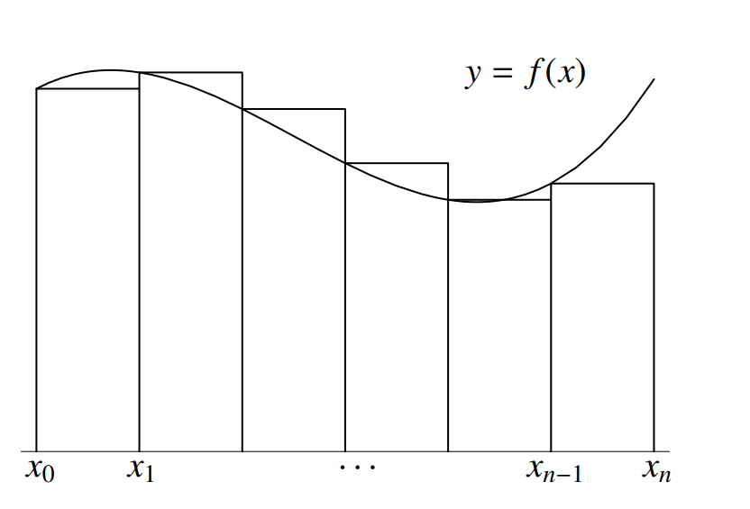

# Integration

## Summary of the textbook

#### Indefinite integration {-}

- **Integration**  In calculus, the inverse of differentiation is called integration.

- **Integral** In general, if $F′(x) = f(x)$, then $F(x)$ is said to be the **integral (sometimes called the anti-derivative or primitive)** of $f(x)$ and is written $$F(x)=\int f(x)dx.$$

- **Constant of integration** In general, if $F(x)$ is any function that differentiates to $f(x)$, then so does $F(x) + c$. The arbitrary constant, $c$, is called the *constant of integration*. 

#### Definite integration {-}

- **Definite integral** In general, the definite integral
$$\int_{a}^b f(x)dx$$ denotes the *area* under the graph of $f(x)$ between $x = a$ and $x = b$. The
numbers $a$ and $b$ are called the **limits of integration**.

- **Consumer's surplus** The excess cost that a person would have been prepared to pay for goods
over and above what is actually paid.

- **Producer’s surplus** The excess revenue that a producer has actually received over and above the
lower revenue that it was prepared to accept for the supply of its goods.

- **Net investment** Rate of change of capital stock over time: $$I = \frac{dK}{dt}.$$

## Additional notes

**Area under a curve** Find the area of the region that lies under the curve $y=x^2$ and above the $x$-axis for $x$ between $0$ and $1$.

- First we divide the interval $[0,1]$ into finitely many sub-intervals of equal lengths:
  $$\left[0,\frac{1}{n}\right],\left[\frac{1}{n},\frac{2}{n}\right],\ldots,\left[\frac{n-1}{n},1\right].$$
  
- For each sub-interval $\left[\frac{i-1}{n},\frac{i}{n}\right]$, we consider the rectangular region with base on the sub-interval and height $\left(\frac{i-1}{n}\right)^2$.
The sum of the area of these rectangular regions is smaller than that of the required region.

\begin{align}
S_n&=\frac{1}{n}\cdot 0^2 + \frac{1}{n}\cdot\left(\frac{1}{n}\right)^2+\cdots+\frac{1}{n}\cdot\left(\frac{n-1}{n}\right)^2\\
&=\frac{1^2+2^2+\ldots,(n-1)^2}{n}\\
&=\frac{n(n-1)(2n-1)}{6n^3}\\
&=\frac{1}{3}-\frac{1}{2n}+\frac{1}{6n^2} (\#eq:area)
\end{align}

- If $n$ is very large, the error is very small and we get a good approximation for the required area. It is clear that if $n$ is very large (so that the error is small), $S_n$ is very close to $\frac{1}{3}$.

**Theorem** Let $f$ be a function that is continuous on a closed and bounded interval $[a,b]$. Then the following limit exists:
$$\underset{n\rightarrow\infty}{\lim}\sum_{i=1}^n f(x_{i-1})\cdot\frac{b-a}{n}$$
where $x_i=a+\frac{i}{n}(b-a)$ for $0\le i\le n$.

**Definition** Let $f$ be a function that is continuous on a closed and bounded interval $[a,b]$. The number $\underset{n\rightarrow\infty}{\lim}\sum_{i=1}^n f(x_{i-1})\cdot\frac{b-a}{n}$, where $x_i=a+\frac{i}{n}(b-a)$ for $0\le i\le n$ is called the **definite integral** of $f$ from $a$ to $b$ and is denoted by $\int_{a}^bf(x)dx$, that is 
$$\int_{a}^bf(x)dx=\underset{n\rightarrow\infty}{\lim}\sum_{i=1}^n f(x_{i-1})\cdot\frac{b-a}{n}$$

In the notation $\int_{a}^{b}f(x)dx$  the variable $x$ is called a dummy variable; it can be replaced by any other symbol. For example $\int_{0}^1t^2dt=\frac{1}{3}$.

**Example** The result in \@ref(eq:area) can be written as 
$$\int_{0}^1x^2dx=\frac{1}{3}$$

**Example** Use the definition to find $\int_1^2xdx$

**Rules for Definite Integrals** Let $f$ and $g$ be functions that are continuous on a closed and bounded interval $[a,b]$. Let $\alpha$ be a constant and let $c\in(a;b)$. Then we have

1. $$\int_a^b[f(x)+g(x)]dx=\int_a^bf(x)dx+\int_a^bg(x)dx$$

2. $$\int_a^b\alpha f(x)dx=\alpha\int_a^b f(x)dx$$

3. $$\int_a^b\alpha f(x)dx=\int_a^c f(x)dx+\int_c^b f(x)dx$$

**Terminology** In a definite integral $\int_a^bf(x)dx$,

- The function $f$ is called the integrand.

- The numbers $a$ and $b$ are called the limits of integration.

**Fundamental Theorem of Calculus V1** Let $f$ be a function that is continuous on a closed and bounded interval $[a,b]$. Let $F$ be the function from $[a,b]$ into $\mathbb{R}$ defined by
$$F(x)=\int_a^xf(t)dt ~~~ for ~~ a\leq t \leq b.$$

Then $F$ is continuous on $[a,b]$ and differentiable on $(a,b)$ with $F'(x)=f(x)$ for all $x\in(a,b)$.

**Definition** Let $f$ be a function that is continuous on a closed and bounded interval $[a,b]$. Suppose that $G$ is a function that is defined on $[a,b]$ such that the following two conditions are satisfied:

1. $G$ is continuous on $[a,b]$;

2. $G$ is differentiable on $(a,b)$ and $G'(x)=f(x)$ for all $x\in(a,b)$.

Then we say that $G$ is a **primitive** for $f$ on $[a,b]$.

# Linear programming

- **Feasible region** The set of points which satisfy all of the constraints in a linear programming
problem.

- **Objective function** The function that is optimised in a linear programming problem.

- **Non-negativity constraints** The constraints $x ≥ 0, y ≥ 0$, etc.

- **Unbounded region** A feasible region that is not completely enclosed by a polygon. The associated
linear programming problem may not have a finite solution.

  
  
  
  
  

