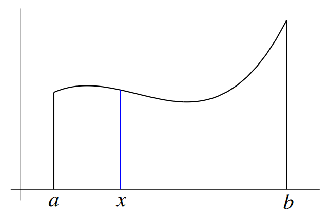

# Integration

## Summary of the textbook

#### Indefinite integration {-}

- **Integration**  In calculus, the inverse of differentiation is called integration.

- **Integral** In general, if $F′(x) = f(x)$, then $F(x)$ is said to be the **integral (sometimes called the anti-derivative or primitive)** of $f(x)$ and is written $$F(x)=\int f(x)dx.$$

- **Constant of integration** In general, if $F(x)$ is any function that differentiates to $f(x)$, then so does $F(x) + c$. The arbitrary constant, $c$, is called the *constant of integration*. 

#### Definite integration {-}

- **Definite integral** In general, the definite integral
$$\int_{a}^b f(x)dx$$ denotes the *area* under the graph of $f(x)$ between $x = a$ and $x = b$. The
numbers $a$ and $b$ are called the **limits of integration**.

- **Consumer's surplus** The excess cost that a person would have been prepared to pay for goods
over and above what is actually paid.

- **Producer’s surplus** The excess revenue that a producer has actually received over and above the
lower revenue that it was prepared to accept for the supply of its goods.

- **Net investment** Rate of change of capital stock over time: $$I = \frac{dK}{dt}.$$

## Additional notes

*It is quite surprising that differentiation and integration are related— they are reverse process of each other.*

**Area under a curve** Find the area of the region that lies under the curve $y=x^2$ and above the $x$-axis for $x$ between $0$ and $1$.

- First we divide the interval $[0,1]$ into finitely many sub-intervals of equal lengths:
  $$\left[0,\frac{1}{n}\right],\left[\frac{1}{n},\frac{2}{n}\right],\ldots,\left[\frac{n-1}{n},1\right].$$
  
- For each sub-interval $\left[\frac{i-1}{n},\frac{i}{n}\right]$, we consider the rectangular region with base on the sub-interval and height $\left(\frac{i-1}{n}\right)^2$.
The sum of the area of these rectangular regions is *smaller* than that of the required region.

\begin{align}
S_n&=\frac{1}{n}\cdot 0^2 + \frac{1}{n}\cdot\left(\frac{1}{n}\right)^2+\cdots+\frac{1}{n}\cdot\left(\frac{n-1}{n}\right)^2\\
&=\frac{1^2+2^2+\ldots,(n-1)^2}{n}\\
&=\frac{n(n-1)(2n-1)}{6n^3}\\
&=\frac{1}{3}-\frac{1}{2n}+\frac{1}{6n^2} (\#eq:area)
\end{align}

- If $n$ is very large, the error is very small and we get a good approximation for the required area. It is clear that if $n$ is very large (so that the error is small), $S_n$ is very close to $\frac{1}{3}$.

**Theorem** Let $f$ be a function that is *continuous* on a *closed and bounded* interval $[a,b]$. Then the following limit exists:
$$\underset{n\rightarrow\infty}{\lim}\sum_{i=1}^n f(x_{i-1})\cdot\frac{b-a}{n}$$
where $x_i=a+\frac{i}{n}(b-a)$ for $0\le i\le n$.

**Definition** Let $f$ be a function that is continuous on a closed and bounded interval $[a,b]$. The number $\underset{n\rightarrow\infty}{\lim}\sum_{i=1}^n f(x_{i-1})\cdot\frac{b-a}{n}$, where $x_i=a+\frac{i}{n}(b-a)$ for $0\le i\le n$ is called the **definite integral** of $f$ from $a$ to $b$ and is denoted by $\int_{a}^bf(x)dx$, that is 
$$\int_{a}^bf(x)dx=\underset{n\rightarrow\infty}{\lim}\sum_{i=1}^n f(x_{i-1})\cdot\frac{b-a}{n}$$

In the notation $\int_{a}^{b}f(x)dx$  the variable $x$ is called a dummy variable; it can be replaced by any other symbol. For example $\int_{0}^1t^2dt=\frac{1}{3}$.

**Remark** More generally,the sub-intervals $[x_0,x_1],\ldots, [x_{n−1},x_n]$ need not be of equal lengths. All we need is that the lengths are small enough: if $a=x_0<x_1<···<x_n=b$ and $\Delta x_1, \ldots, \Delta x_n$ are small enough, where $\Delta x_i$ is the length of the $i$th sub-interval $[x_{i−1},x_i]$, then for every choice of $t_1,\ldots, t_n$ with $t_i\in[x_{i−1},x_i]$ for $1≤i≤n$, the sum (called a Riemann Sum)
$$\sum_{i=1}^nf(t_i)\Delta x_i$$
is close to the definite integral $\int_{a}^bf(x)dx$. That is $$\int_{a}^bf(x)dx=\underset{||\Delta x||\rightarrow 0}{\lim}{\sum_{i=1}^nf(t_i)\Delta x_i},$$
where $||\Delta x||\rightarrow0$ means the lengths $\Delta x_i$'s tend to zero.

**Remark** The symbol $\int$ was introduced by Leibniz and is called the **integral sign**. It is an elongated $S$ and was chosen because a definite integral is a limit of sums.

**Example** The result in \@ref(eq:area) can be written as 
$$\int_{0}^1x^2dx=\frac{1}{3}$$

**Example** Use the definition to find $\int_1^2xdx$.

**Rules for Definite Integrals** Let $f$ and $g$ be functions that are continuous on a closed and bounded interval $[a,b]$. Let $\alpha$ be a constant and let $c\in(a;b)$. Then we have

1. $$\int_a^b[f(x)+g(x)]dx=\int_a^bf(x)dx+\int_a^bg(x)dx$$

2. $$\int_a^b\alpha f(x)dx=\alpha\int_a^b f(x)dx$$

3. $$\int_a^b\alpha f(x)dx=\int_a^c f(x)dx+\int_c^b f(x)dx$$

**Terminology** In a definite integral $\int_a^bf(x)dx$,

- The function $f$ is called the integrand.

- The numbers $a$ and $b$ are called the limits of integration.

**Fundamental Theorem of Calculus V1** Let $f$ be a function that is continuous on a closed and bounded interval $[a,b]$. Let $F$ be the function from $[a,b]$ into $\mathbb{R}$ defined by
$$F(x)=\int_a^xf(t)dt ~~~ for ~~ a\leq t \leq b.$$

Then $F$ is continuous on $[a,b]$ and differentiable on $(a,b)$ with $F'(x)=f(x)$ for all $x\in(a,b)$.

**Proof** We have $$F'(x)=\underset{h\rightarrow 0}{\lim}\frac{F(x+h)-F(x)}{h}$$

For $x\in(a,b)$ and for sufficiently small $h>0$ such that $a+h\leq b$, we have 
\begin{align}
F(x+h)-F(x) &= \int_a^{x+h}f(t)dt-\int_a^xf(t)dt\\
&= \left(\int_a^xf(t)dt+\int_x^{x+h}f(t)dt\right)-\int_a^xf(t)dt\\
&=\int_x^{x+h}f(t)dt
\end{align}
Note that $\int_x^{x+h}f(t)dt$ is the area of the region below the graph of $f$ from $x$ to $x+h$. If $h$ is small, then the area of the small region under consideration can be approximated by the area of the rectangular region with base $[x,x+h]$ on the horizontal axis and height equal to $f(x)$. Thus we have 
$$\int_{x}^{x+h}f(t)dt$$
is close to $f(x)\cdot h$ if $h$ is small, from which we obtain
$$\frac{F(x+h)-F(x)}{h}=\frac{\int_x^{x+h}f(t)dt}{h}$$
is close to $f(x)$ if $h$ is small. Taking limit, we get $F'(x)=f(x)$.

**Remark** To find the definite integral $\int_a^bf(x)dx$, we should look for functions $G$ such that $G'=f$.

**Definition** Let $f$ be a function that is continuous on a closed and bounded interval $[a,b]$. Suppose that $G$ is a function that is defined on $[a,b]$ such that the following two conditions are satisfied:

1. $G$ is continuous on $[a,b]$;

2. $G$ is differentiable on $(a,b)$ and $G'(x)=f(x)$ for all $x\in(a,b)$.

Then we say that $G$ is a **primitive** for $f$ on $[a,b]$.

**Example** $G(x)=x^3$ is a primitive for $f(x)=3x^2$.

**Theorem** Let $F$ and $G$ be functions that are defined on a closed and bounded interval $[a,b]$. Suppose that they are continuous on $[a,b]$ and are differentiable on $(a,b)$ with $F'(x)=G'(x)$ for all $x\in(a,b)$. Then on $[a,b]$, the functions $F$ and $G$ differ by a constant, that is, there exists a constant $C$ such that
$$F(x)-G(x)=C$$
for all $x\in[a,b]$.

**Proof** $F'(x)=G'(x)$ for all $x\in(a,b)$ indicates that at corresponding points (same $x$-coordinates) tangents to the graphs of $F$ and $G$ are parallel. Hence, the graph of $F$ can be obtained from that of $G$ by moving it upward ($C>0$) or downward ($C<0$).

**Corollary** Let $f$ be a function that is continuous on a closed and bounded interval $[a,b]$. Suppose that $F$ and $G$ are primitives for $f$ on $[a,b]$. Then on $[a,b]$, the functions $F$ and $G$ differ by a constant.

**Example** Find the value of the definite integral $\int_1^23x^2dx$.

**Fundamental Theorem of Calculus V2** Let $f$ be a function that is continuous on a closed and bounded interval $[a,b]$. Suppose $G$ is a primitive for $f$ on $[a,b]$. Then we have 
$$\int_a^bf(x)dx=G(b)-G(a)$$
 
**Example** Find the value of the definite integral $\int_1^23x^2dx$.

**Notation** $$G(b)-G(a)=\left[G(x)\right]_a^b=G(x)|_a^b$$

**Definition** Let $f$ be a function that is continuous on an open interval $(a,b)$. Suppose $F$ is a function defined on $(a,b)$ such that $F'(x)=f(x)$ for all $x\in(a,b)$. Then we say $F$ is an **antiderivative** for $f$ on $(a,b)$.

**Example** $f(x)=\frac{1}{\sqrt{x}}$, and $F(x)=2\sqrt{x}$. We have $F'(x)=f(x)$ for all $x\in(0,\infty)$. Thus $G$ is an antiderivative for $g$ on every open interval contained in $(0,\infty)$.

**Theorem** Let $f$ be a function that is continuous on an open interval $(a,b)$. Suppose that $F$ and $G$ are antiderivatives for $f$ on $(a,b)$. Then on $(a,b)$, the functions $F$ and $G$ differ by a constant.

**Remark** If we can find one antiderivative for a continuous function $f$ on an open interval $(a,b)$, then we can find all. That is, if $F$ is an antiderivative for $f$ on $(a,b)$, then all the antiderivatives for $f$ on $(a,b)$ are in the form $$F(x)+C,~~~,a\leq x \leq b$$ where $C$ is a constant.

**Definition** We call the family of all antiderivatives for $f$ on $(a,b)$  to be **the indefinite integral** of $f$ (w.r.t. $x$) and we denote it by $\int f(x)dx$. That is, $$\int f(x)dx=F(x)+C, ~~~~ a\leq x\leq b$$
where $F$ is a function such that $F'(x)=f(x)$ for all $x\in(a,b)$ (i.e., $F$ is an antiderivative of $f$ on $(a,b)$) and $C$ is an arbitrary constant, called **constant of integration**.

**Power Rule for Integration** Let $n$ be a positive integer. Then we have $$\int x^ndx=\frac{x^{n+1}}{n+1}+C, ~~~~, -\infty<x<\infty.$$

**Example: Area under Graph of Function** Find the area of the region that is bounded by the curve $y=\sqrt{x}$, the line $x=1$ and the $x$-axis.

**Example: Area between Graphs of Functions** Find the area of the region bounded by the parabola $y=x^2$ and the line $y=x+2$.

**Fundamental Theorem of Calculus V3** Let $f$ be a function such that $f'$ is continuous on an open interval $(a,b)$. Then for every $x_0\in(a,b)$, we have 
$$f(x)=\int_{x_0}^xf'(t)dt+f(x_0)$$
for all $x\in(a,b)$.

**Example** Find the cost function if the marginal cost is $3+40x-5x^2$ and the fixed cost is $45$.

**Theorem** Let $f$ be a function such that $f'$ is continuous on an open interval $(a,b)$. Then for every pair of number $x_0,x_1$ in $(a,b)$, we have $$\int_{x_0}^{x_1}dt=f(x_1)-f(x_0).$$

**Example** A particle moves along a line so that its velocity at time $t$ is $v(t)=t^2-t$ meters per second. Find the displacement of the particle during the time period $1\leq t\leq 2.$

  
  
  
  
  

