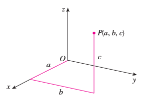
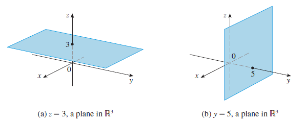
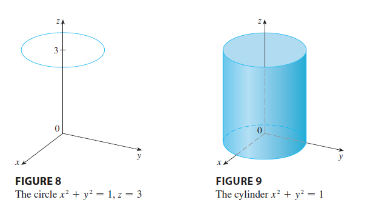
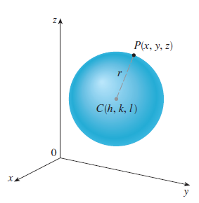
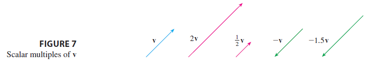

# Vectors and Geometry of Space

## Three-Dimensinal Coordinate Systems 

**Definition** The three coordinate axes determine the three coordinate planes. These three coordinate planes divide space into eight parts, called octants. 
The first octant is determined by the positive axes.

**Coordinates** We represent the point $P$ by the ordered triple $(a,b,c)$. We call $a, b, c$ the coordinates of $P$.

**Projection** The point $P(a,b,c)$ determines a rectangular box. If we drop a perpendicular from $P$ to each coordinate plane. We get three projections of $P$ as $Q(a,b,0), R(0,b,c), S(a,0,c)$.

**Three dimensional rectangular coordinate system** The Cartesian product $\mathbf{R}\times\mathbf{R}\times\mathbf{R}=\{(x,y,z)|x,y,z\in\mathbf{R}\}$ is the set of all ordered triples of real numbers and is denoted by $R^3$.

**Surface** In three-dimensional analytica geometry, an equation in $x,y,z$ represents a surface in $R^3$.

**Distance** The distance $|P_1P_2|$ between the points $P_1(x_1,y_1,z_1)$ and $P_2(x_2,y_2,z_2)$ is 
$$|P_1P_2|=\sqrt{(x_2-x_1)^2+(y_2-y_1)^2+(z_2-z_1)^2}$$

**Equation of a sphere** An equation of a sphere with center $C(h,k,l)$ and radius $r$ is 
$$(x-h)^2+(y-k)^2+(z-l)^2=r^2.$$

## Vectors

**Definition** A quantity (such as displacement or velocity or force) with both magnitude and direction. 

**Example** For instance, suppose a particle moves along a line segment from point $A$ to point $B$. The corresponding displacement vector $\mathbf{v}$ has initial point $A$ (the tail) and terminal point $B$ (the tip), and we indicate this by writing $\mathbf{v}=\overset{\longrightarrow}{AB}$. Notice that if a vector $\mathbf{u}$ has the same length and the same direction even though it is in a different position. We say $\mathbf{u}$ and $\mathbf{v}$ are equivalent and we write $\mathbf{u}=\mathbf{v}$.

**Vector addition** If $\mathbf{u}$ and $\mathbf{v}$ are vectors positioned so the initial point of $\mathbf{v}$ is at the terminal point of $\mathbf{u}$, then the sum $\mathbf{u}+\mathbf{v}$  is the vector from the initial point of $\mathbf{u}$  to the terminal point of $\mathbf{v}$.

**Scalar multiplication** If $c$ is a scalar and $\mathbf{v}$ is a vector, then the scalar multiple $c\mathbf{v}$ is the vector whose length is $|c|$ times the length of $\mathbf{v}$ and whose direction is the same as $\mathbf{v}$ if $c>0$ and is opposite to $\mathbf{v}$ if $c<0$.

**Components** 

## Dot Product

## Cross Product

## Equations of Lines and Planes

## Directional Derivatives and  Gradient Vector

## More on Lagrange Multipliers

