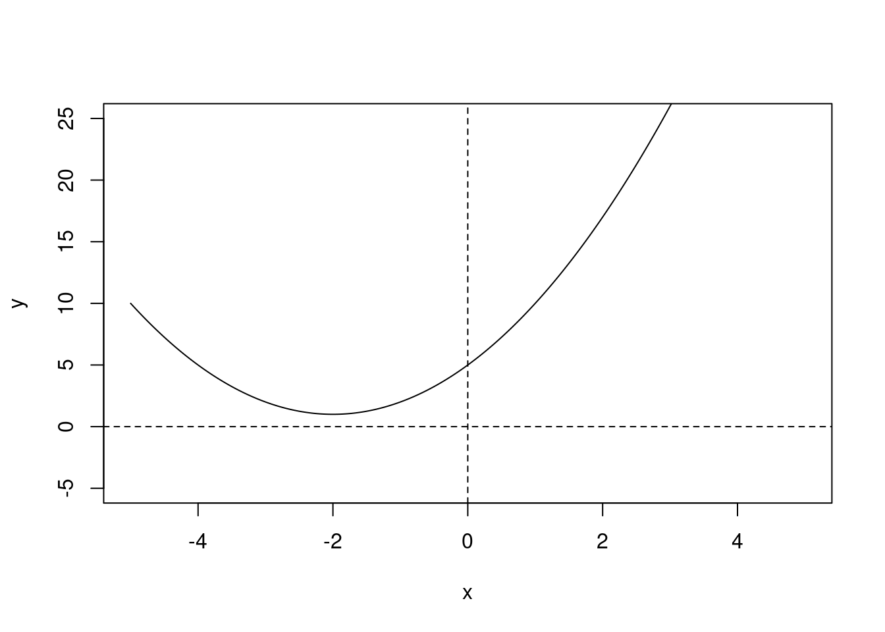
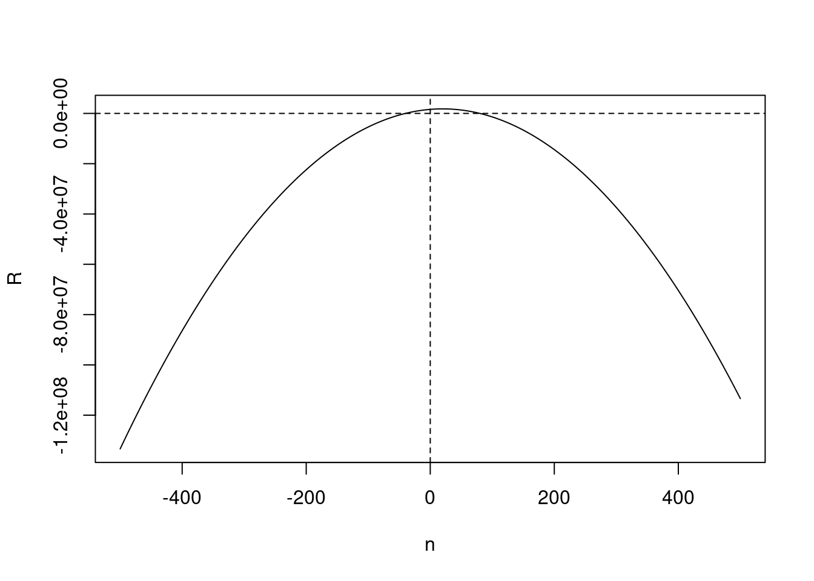
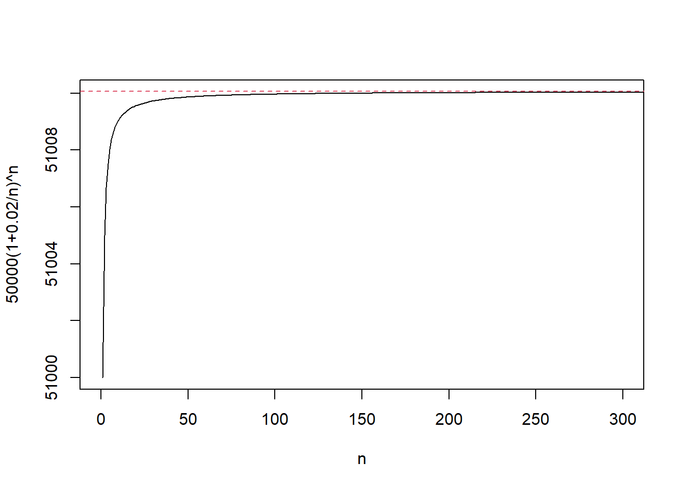
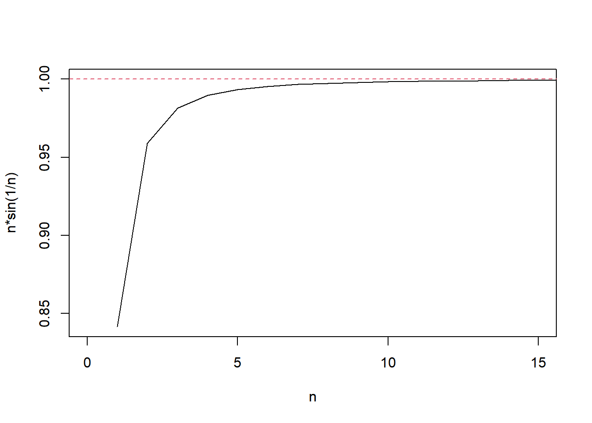
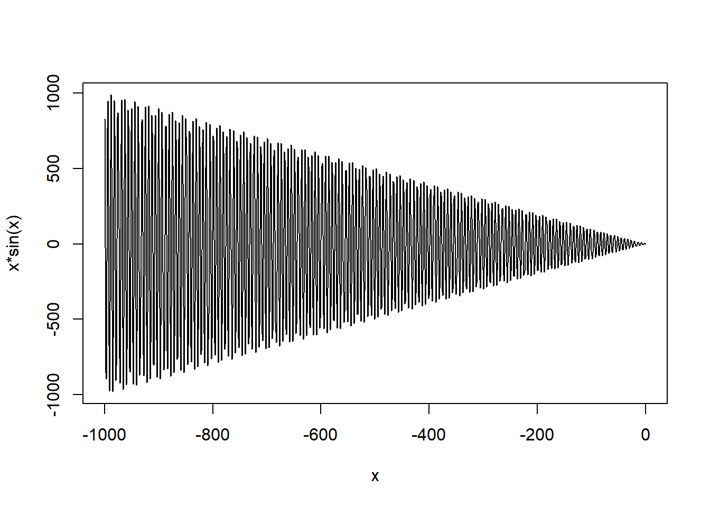
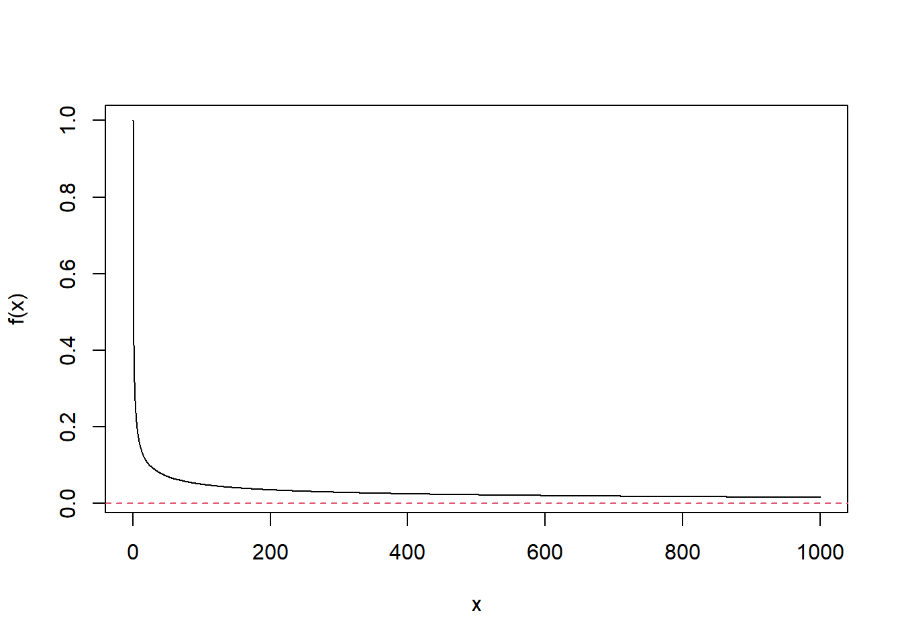
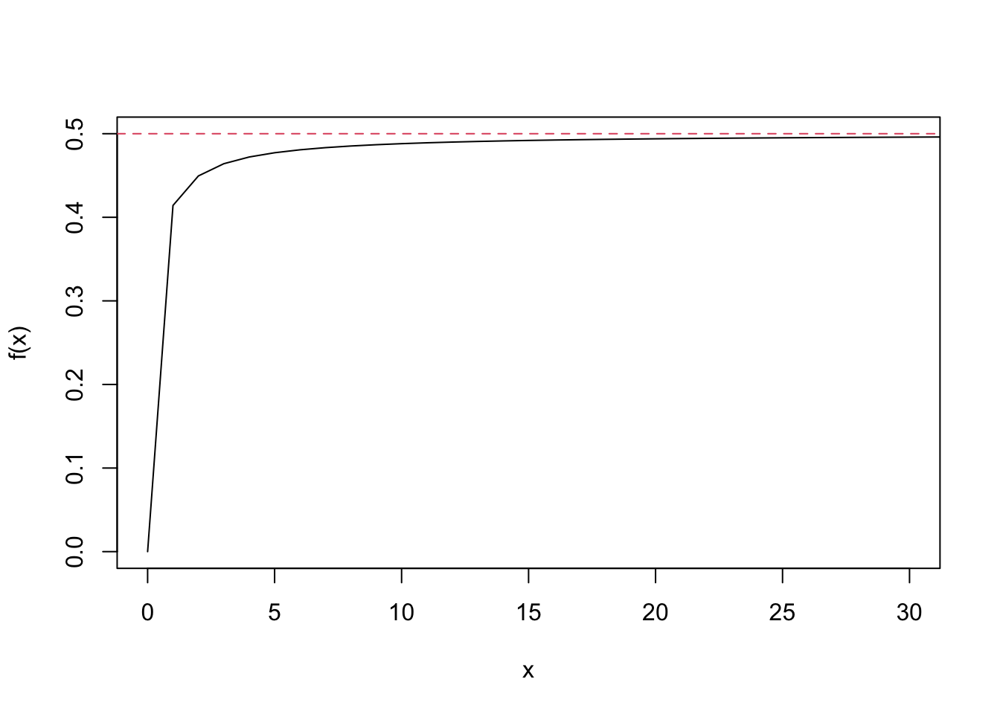
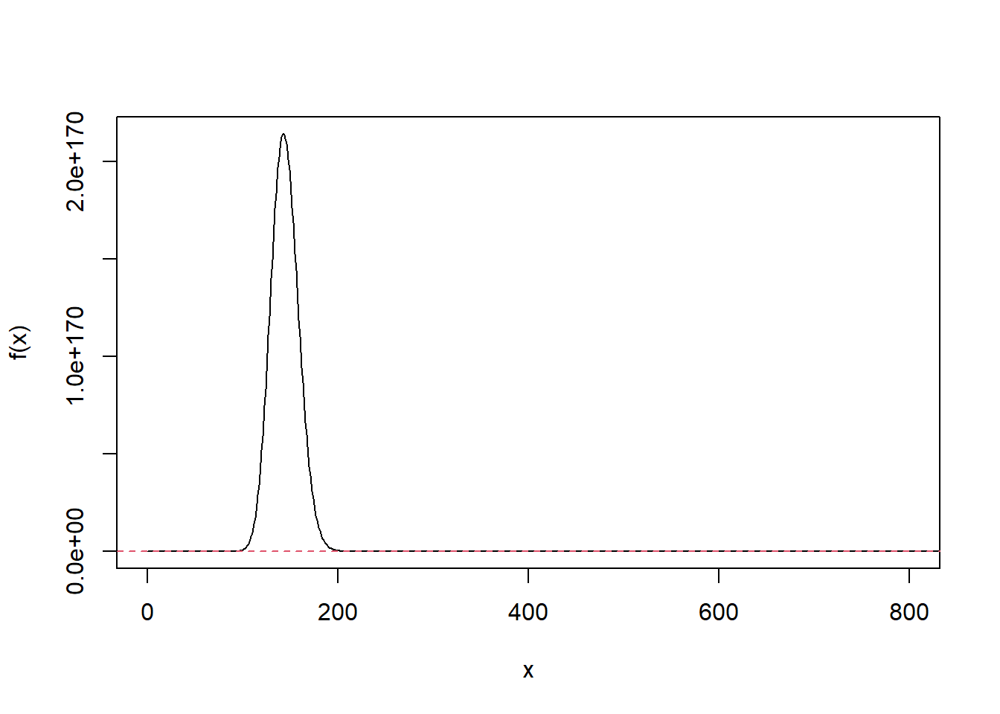
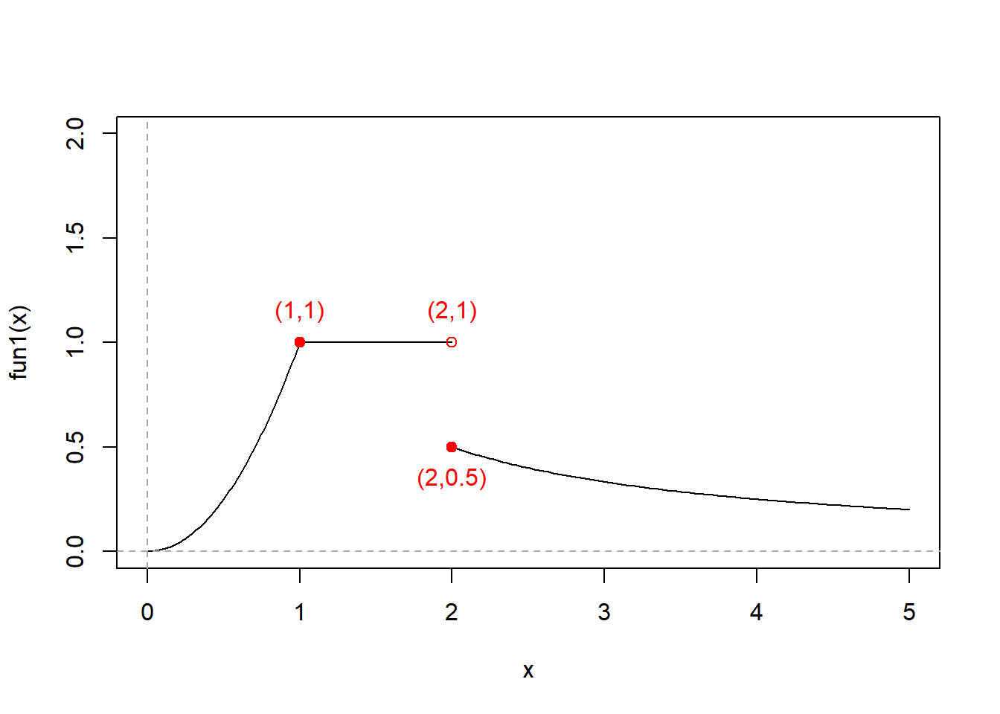

# (PART) 💡 SOLUTIONS {-}


# Chapter 1 {- #ch1}

## Exercise 1.1 {- #q1.1}

### Q1 {- #q1.1.1}
(Fernando Li)

(a) $$ A \cap B = \lbrace 2,3,5,7 \rbrace $$
(b) $$ A \cap C = \lbrace 2,4,6,8,10 \rbrace $$
(c) $$ B \cap C = \lbrace 2 \rbrace $$
(d) $$ A \cup B = \lbrace 1,2,3,4,5,6,7,8,9,10,11,13,17,19 \rbrace $$
(e) $$ A \cup C = \lbrace 1,2,3,4,5,6,7,8,9,10,12,14,16,18 \rbrace $$
(f) $$ B \cup C = \lbrace 2,3,4,5,6,7,8,10,11,12,13,14,16,17,18,19 \rbrace $$
(g) $$ A \cup B \cup C = \lbrace 1,2,3,4,5,6,7,8,9,10,11,12,13,14,16,17,18,19 \rbrace $$
(h) $$ A \cap B \cap C = \lbrace 2 \rbrace $$
(i) $$ (A \cup B) \cap C = \lbrace 2,4,6,8,10 \rbrace $$
(j) $$ (A \cap B) \cup C = \lbrace 2,3,4,5,6,7,8,10,12,14,16,18 \rbrace $$
(k) $$ A \cap B' = \lbrace 1,4,6,8,9,10 \rbrace $$
(l) $$ 'A \cap B' = \lbrace 12,14,15,16,18 \rbrace $$

### Q2 {- #q1.1.2}
(David Rosa)

(a)false, a counterexample is as follows
$$ A = \lbrace 1,2,3,4 \rbrace \\
   B = \lbrace 3,4,5,6 \rbrace \\
   U = \lbrace 1,2,3,4,5,6,7,8 \rbrace \\$$
Then $$ A - B = \lbrace 1,2 \rbrace \\
        A' = \lbrace 5,6,7,8 \rbrace \\
        A' \cap B = \lbrace 5,6 \rbrace \\$$
Thus $$ A - B = A' \cap B $$ is false.

(b)false, a counterexample is as follows
$$ A = \lbrace 1,2 \rbrace \\
   B = \lbrace 2,3 \rbrace \\
   C = \lbrace 3,4 \rbrace \\
   U = \lbrace 1,2,3,4,5 \rbrace \\$$
Then $$ A \cup B = \lbrace 1,2,3 \rbrace \\
        (A \cup B) \cap C = \lbrace 3 \rbrace \\
        B \cap C = \lbrace 3 \rbrace \\
        A \cup ( B \cap C) = \lbrace 1,2,3 \rbrace \\ $$
Thus $$ (A \cup B) \cap C = A \cup ( B \cap C) $$ is false.

(c)true
As $$ B' \cap B = \emptyset $$
$$ (A' \cup B') \cap B = (A' \cap B) \cup (B' \cap B) \\
= (A' \cap B) \cup \emptyset \\
= A' \cap B \\
= \lbrace x \in U : x \in B \ and \ x \in A' \rbrace\\
= \lbrace x \in U : x \in B \ and \ x \notin A \rbrace\\
= B -A $$

## Exercise 1.2 {- #q1.2}

### Q1 {- #q1.2.1} 

(a) $$ \lbrace x:\pm \sqrt2 \rbrace $$
(b) $$ \lbrace x: \sqrt2 \rbrace $$
(c)Q means rational numbers, so $$\lbrace x \in Q: x^2 = 2 \rbrace =  \emptyset $$

### Q2 {- #q1.2.2} 
(Jiin Kim)

(a)$$ A \cap B = [3,5]  $$
(b)$$ A \cup B = [1,9)  $$
(c)$$ A - C = (1,5)  $$
(d)$$ B \cap C = \lbrace 5 \rbrace  $$
(e)$$ C - B = \lbrace 1 \rbrace  $$
(f)$$ B - C = [3,5) \cup (5,9) $$
(g)$$ B - (B - C) = \lbrace 5 \rbrace $$
(h)$$ A \cup D = [1,\infty)  $$
(i)$$ C \cap D = \lbrace 5 \rbrace  $$

## Exercise 1.3 {- #q1.3}

### Q1 {- #q1.3.1}
(Maria Kahlert)

(a)$$ 2x-3 \geq 4+7x \\
      2x-7x \geq 4+3 \\
      -5x \geq 7 \\
      x \leq -\frac{7}{5}$$

(b)$$ 8(x+1)-2 < 5(x-6)+7 \\
      8x+8-2 < 5x-30+7 \\
      3x < -29 \\
      x < -\frac{29}{3}$$

(c)As $$ x^2+1 > 0 $$
$$ \frac{x^2-3x+7}{x^2+1} < 1 \\
      x^2-3x+7 < x^2+1  \\
      -3x < -6 \\
      x > 2$$
(d)$$ (2x+7)(5-11x) \leq 0 \\
      (x+\frac{7}{2})(x - \frac{5}{11}) \geq 0 \\
      x \geq \frac{5}{11} \ or\  x \leq -\frac{7}{2}$$

(e)$$ (x^2-2x-3) <0 \\
      (x-3)(x+1) <0 \\
      -1<x<3$$
(f)$$ 2x^2-3x > 4 \\
      2x^2-3x-4 > 0 $$
When $$ 2x^2-3x-4 = 0 $$
$$ x = \frac{-(-3) \pm \sqrt{[(-3)^2-4\times2\times(-4)]} }{2\times2}\\
     = \frac{3 \pm \sqrt{41} }{4}$$
Thus $$ 2x^2-3x-4 > 0 \\
  x < \frac{3 - \sqrt{41} }{4} \ or \ x > \frac{3 + \sqrt{41} }{4}$$

(g)$$ 2x^2-3x < -4 \\
      2x^2-3x+4 < 0 $$
When $$ 2x^2-3x+4 = 0 $$
$$ (-3)^2-4\times2\times4 = -23 <0 $$
Thus the equation has no solution.
Thus $$ 2x^2-3x+4 < 0 \\
  x \in \emptyset $$
(h)$$ \frac{2x+3}{x-4} \geq 0 \\
      (2x+3)(x-4) \geq 0 \ and\  x \neq 4 \\
      (x+\frac{3}{2})(x-4) \geq 0 \ and\  x \neq 4 \\
      x > 4 \ or \  x \leq -\frac{3}{2}$$
(i)$$ \frac{2x+3}{x-4} < 1 \\
\frac{2x+3}{x-4} -1 <0 \\
\frac{2x+3}{x-4} - \frac{x-4}{x-4} <0\\
\frac{x+7}{x-4} < 0 \\
      (x+7)(x-4) < 0 \\
      -7<x<4$$

### Q2 {- #q1.3.2}

(a)$$ 2x^3+7x^2-15x = x(2x^2+7x-15) \\
                    = x(x+5)(2x-3)$$
(b)$$ 2x^3+3x^2-2x-3 = (2x^3-2x)+(3x^2-3) \\
                     = 2x(x^2-1) + 3(x^2-1) \\
                     = (2x+3)(x^2-1) \\
                     = (2x+3)(x+1)(x-1)$$
(c)$$ x^3-x^2-x-2 = (x^3-1)-(x^2+x+1) \\
                  = (x-1)(x^2+x+1)-(x^2+x1) \\
                  = (x-1-1)(x^2+x+1) \\
                  = (x-2)(x^2+x+1)$$
(d)$$ x^4-3x^3-13x^2+15x = x(x^3-3x^2-13x+15) \\
                         = x[(x^3-x)+(-3x^2-12x+15)] \\
                         = x[x(x^2-1)-3(x^2+4x-5)] \\
                         = x[x(x+1)(x-1)-3(x-1)(x+5)] \\
                         = x(x-1)[x(x+1)-3(x+5)] \\
                         = x(x-1)(x^2-2x-15)\\
                         = x(x-1)(x+3)(x-5)$$
(e)$$ x^4-3x^3+x^2+3x-2 = (x^4+x^2-2)+(-3x^3+3x) \\
= (x^2+2)(x^2-1)-3x(x^2-1) \\
= (x^2+2-3x)(x^2-1) \\
= [(x-2)(x-1)][(x+1)(x-1)] \\
= (x-2)(x+1)(x-1)^2$$

(f)$$  x^4-x^3+x^2-3x+2 = (x^4-x^3)+(x^2-3x+2) \\
= x^3(x-1)+(x-1)(x-2) \\
= (x-1)(x^3+x-2) \\
= (x-1)[(x^3-1)+(x-1)] \\
= (x-1)[(x-1)(x^2+x+1)+(x-1)] \\
= (x-1)^2(x^2+x+2)$$

### Q3 {- #q1.3.3}
(Ashley a-d; Byoungchurl Lee e-h)


(a)$$ (x-4)(9-5x)(2x+3) < 0 \\
      (x-4)(x-\frac{9}{5})(x+\frac{3}{2}) >0 \\
      x \in ( -\frac{3}{2},\frac{9}{5}) \cup (4, \infty)$$
(b)$$ (x-3)(2x+1)^2 \leq 0 \\
      (x-3)(x+\frac{1}{2})^2 \leq 0 \\
      x \in (-\infty, 3] $$
(c)$$ x^3-2x^2-5x+6 < 0 \\
      (x^3-x)+(-2x^2-4x+6) < 0\\
      x(x^2-1)-2(x^2+2x-3) < 0\\
      x(x-1)(x+1)-2(x+3)(x-1) < 0\\
      (x-1)[x(x+1)-2(x+3)] < 0 \\
      (x-1)(x^2-x-6) < 0 \\
      (x-1)(x-3)(x+2) <0 \\
      x \in (-\infty,-2) \cup (1,3) $$

(d)$$ -2x^3+x^2+15x-18 \leq 0 \\
      (-2x^3+8x)+(x^2+7x-18) \leq 0 \\
      -2x(x^2-4)+(x-2)(x+9) \leq 0 \\
      -2x(x+2)(x-2)+(x-2)(x+9) \leq 0 \\
      (x-2)[-2x(x+2)+(x+9)] \leq 0 \\
      (x-2)(-2x^2-3x+9) \leq 0 \\
      (x-2)(-2x+3)(x+3) \leq 0 \\
      (x-2)(x-\frac{3}{2})(x+3) \geq 0 \\
      x \in [-3,\frac{3}{2}] \cup [2,\infty)$$
(e)$$ x^3-x^2-5x-3 > 0 \\
      (x^3-x)+(-x^2-4x-3) > 0 \\
      x(x^2-1)-(x^2+4x+3) > 0 \\
      x(x-1)(x+1)-(x+3)(x+1) > 0 \\
      (x+1)[x(x-1)-(x+3)] > 0\\
      (x+1)(x^2-2x-3) > 0 \\
      (x+1)(x-3)(x+1) > 0 \\
      (x+1)^2(x-3) > 0 \\
      x \in (3,\infty)$$


(f)$$ x^3+3x^2+5x+3 \leq 0 \\
      (x^3-x)+(3x^2+6x+3) \leq 0 \\
      x(x^2-1)+3(x^2+2x+1) \leq 0 \\
      x(x-1)(x+1)+3(x+1)^2 \leq 0 \\
      (x+1)[x(x-1)+3(x+1)] \leq 0 \\
      (x+1)(x^2+2x+3) \leq 0 \\
      $$
As $$ x^2+2x+3 = (x^2+2x+1)+2 = (x+1)^2+2 > 0 $$
Thus $$ x^3+3x^2+5x+3=(x+1)(x^2+2x+3) \leq 0 \\
      x \in (-\infty,-1] $$
      
      
(g)$$ x^4+2x^3-13x^2-14x+24 > 0 \\
      (x^4+2x^3-3x^2)+(-10x^2-14x+24) > 0 \\
      x^2(x^2+2x-3)-2(5x^2+7x-12) > 0 \\
      x^2(x+3)(x-1)-2(x-1)(5x+12) > 0 \\
      (x-1)[x^2(x+3)-2(5x+12)] > 0 \\
      (x-1)(x^3+3x^2-10x-24) > 0 \\
      (x-1)[(x^3+3x^2+2x)+(-12x-24) >0\\
      (x-1)[x(x^2+3x+2)-12(x+2)]>0\\
      (x-1)[x(x+1)(x+2)-12(x+2)]>0\\
      (x-1)(x+2)[x(x+1)-12]>0\\
      (x-1)(x+2)(x^2+x-12) > 0\\
      (x-1)(x+2)(x+4)(x-3) > 0\\
      x \in (-\infty,-4) \cup (-2,1) \cup (3,\infty)$$
(h)$$ 6x^4+x^3-15x^2 \leq 0 \\
      x^2(6x^2+x-15) \leq 0 \\
      x^2(2x-3)(3x+5) \leq 0 \\
      x \in [-\frac{5}{3},\frac{3}{2}]$$

# Chapter 2 {- #ch2}

## Exercise 2.1 {- #q2.1}
()

## Exercise 2.2 {- #q2.2}

### Q1 {- #q2.2.1}
(Trang-Paige Tran a,c,e,g)

(a)$$ dom(f) = (-\infty,+\infty) $$

(b)$$ 5x+6 \neq 0 \\
      x \neq -\frac{6}{5} \\
      dom(f) = (-\infty,-\frac{6}{5}) \cup (-\frac{6}{5},+\infty)$$

(c)$$ x^2-5 \neq 0 \\
      x \neq \pm \sqrt{5} \\
      dom(f) = (-\infty,-\sqrt{5}) \cup (-\sqrt{5},\sqrt{5}) \cup (\sqrt{5},+\infty)$$

(d)$$ x^2-2x-3 \neq 0 \\
      (x-3)(x+1) \neq 0 \\
      x \neq -1 \ or \ x \neq 3 \\
      dom(f) = (-\infty,-1) \cup (-1,3) \cup (3,+\infty)$$

(e)$$ \left\{\begin{aligned}
2x-3 \geq 0 \\
2x-3 \neq 0 \\
\end{aligned}\right. \\
2x-3>0 \\
x > \frac{3}{2} \\
dom(f)=(\frac{3}{2},+\infty)$$

(f)$$ \left\{\begin{aligned}
1-2x \neq 0 \\
x+3 \geq 0 \\
\end{aligned}\right. \\
\left\{\begin{aligned}
x \neq \frac{1}{2} \\
x \geq -3 \\
\end{aligned}\right.\\
dom(f)=[-3,\frac{1}{2}) \cup (\frac{1}{2},+\infty)$$

(g)$$ \left\{\begin{aligned}
1-x^2 \neq 0 \\
2x+5 \geq 0 \\
\end{aligned}\right. \\
\left\{\begin{aligned}
x \neq \pm 1 \\
x \geq -\frac{5}{2} \\
\end{aligned}\right.\\
dom(f)=[-\frac{5}{2},-1) \cup (-1,1) \cup  (1,+\infty)$$

(h)$$ \left\{\begin{aligned}
x^2+3x-10 \neq 0 \\
x^2+3x-10 \geq 0 \\
\end{aligned}\right. \\
x^2+3x-10 > 0 \\
(x+5)(x-2) > 0 \\
x < -5 \ or \ x > 2 \\
dom(f)=(-\infty,-5) \cup (2,+\infty)$$

### Q2 {- #q2.2.2}
(Trang-Paige Tran a,c,e,g)

(a)$$ f(x)=y=x^2-5 \\
      x^2 = y+5 \\
      only \ if \ y+5 \geq 0, x = \pm \sqrt{y+5} \\
      we \ get \ y \geq -5 \\
      ran(f) = [-5,+\infty)$$
(b)This is a parabola with an upward opening, and the minimum value is :
$$  f(x) = x^2-2x-3 \\
         = (x-1)^2-4 $$ 
Thus the minimum value is -4, when x=1.
$$ ran(f) = [-4,+\infty)$$
(c)$$ f(x)=y=\frac{2}{5x+6} \\
      5x+6 = \frac{2}{y} \\
      5x = \frac{2}{y} - 6 \\
      x = \frac{2}{5y}-\frac{6}{5} \\
      x \ can \  be \  solved \ if \ and \ only \ if \ y \neq 0 \\
      ran(f) = (-\infty,0) \cup (0, +\infty)$$
(d)$$ f(x)=y=3-\frac{1}{2x-1} \\
      \frac{1}{2x-1} = 3-y \\
      2x-1 = \frac{1}{3-y} \\
      2x = \frac{1}{3-y}+1 \\
      x = \frac{1}{2(3-y)}+\frac{1}{2} \\
      x \ can \  be \  solved \ if \ and \ only \ if \ 2(3-y) \neq 0 \\
      y \neq 3 \\
      ran(f) = (-\infty,3) \cup (3, +\infty)$$
      
(e)$$ f(x)=y=\frac{1}{\sqrt{2x-3}} \\
      \sqrt{2x-3} = \frac{1}{y} \\
      only \ if \ y \geq 0, 2x-3 = \frac{1}{y^2} \\
      2x = \frac{1}{y^2}+3 \\
      x = \frac{1}{2y^2}+\frac{3}{2}\\
      x \ can \  be \  solved \ if \ and \ only \ if \ y \neq 0 \\
      Thus \ y>0 \\
      ran(f) = (0, +\infty)$$
(f)$$ f(x)=y=\frac{1}{x^2-5} \\
      x^2-5 = \frac{1}{y} \\
      x^2 = \frac{1}{y}+5 \\
      x = \pm \sqrt{\frac{1}{y}+5} \\
      x \ can \  be \  solved \ if \ and \ only \ if \ y \neq 0 \ and \ \frac{1}{y}+5 \geq 0\\
      y > 0 \ or \ y \leq -\frac{1}{5} \\
      ran(f) = (-\infty,-\frac{1}{5}] \cup (0, +\infty)$$     
(g)As in (b), $$f(x)=x^2-2x-3$$
we get $$ ran(f) = [-4,+\infty) $$
Suppose $$ h = x^2-2x-3, h \in [-4,+\infty) $$
Then we get 
$$ f(x)=y=\frac{1}{x^2-2x-3} = \frac{1}{h} \\
      h = \frac{1}{y} \\
      x \ can \  be \  solved \ if \ and \ only \ if \ y \neq 0 \\
      As \ h \in [-4,+\infty), \ Thus \  y > 0 \ or \ y \leq -\frac{1}{4} \\
      ran(f) = (-\infty,-\frac{1}{4}] \cup (0, +\infty)$$  
      
## Exercise 2.3 {- #q2.3}

### Q1 {- #q2.3.1}
(Ju-yeon Sally Choi)

$$ F(x,y)= 2x^2+3y^2-4 $$
As for x-intercepts, 
$$ y=0 \ and \ F(x,y)=0\\
   F(x,y) = 2x^2+3 \times 0^2 - 4 = 2x^2 - 4 = 0\\
   x^2 = 2\\
   x = \pm \sqrt{2}$$
Thus the x-intercepts are $$(-\sqrt{2},0) \ or \ (\sqrt{2},0) $$
As for y-intercepts, 
$$ x=0 \ and \ F(x,y)=0\\
   F(x,y) = 2 \times 0^2+3y^2 - 4 = 3y^2 - 4 = 0\\
   y^2 = \frac{4}{3}\\
   y = \pm \frac{2\sqrt{3}}{3}$$
Thus the x-intercepts are $$(0,-\frac{2\sqrt{3}}{3}) \ or \ (0,\frac{2\sqrt{3}}{3}) $$

### Q2 {- #q2.3.2}
(Ju-yeon Sally Choi)

$$ \left\{\begin{aligned}
0 = a \times 2^2 + b \times 2 + c \\
0 = a \times (-3)^2 + b \times (-3) + c \\
-6 = a \times 0^2 + b \times 0 + c \\
\end{aligned}\right. \\
\left\{\begin{aligned}
0 = 4a + 2b + c \\
0 = 9a - 3b + c \\
-6 = c \\
\end{aligned}\right. \\
\left\{\begin{aligned}
a = 1 \\
b = 1 \\
c = -6\\
\end{aligned}\right. \\$$

### Q3 {- #q2.3.3}
(Ju-yeon Sally Choi)

(a)As for x-intercepts, y = 0
$$ y = 0 = x^2+4x+5 $$
$$ b^2-4ac = 4^2-4 \times 1 \times5 = -4 < 0 $$
Thus the x-intercepts don't exist.

As for y-intercepts, x = 0
$$ y =0^2+4 \times 0 +5 = 5 $$
Thus the y-intercept is $$ (0,5) $$

(b)


### Q4 {- #q2.3.4}
(Oyu Enkhbold)

(a)As $$ 2x+y-3=0 $$ 
We get $$ y = 3-2x $$
Putting into $$ x^2+y^2 =5$$
We get $$ x^2+(3-2x)^2 = 5 \\
          x^2 + 9 - 12x + 4x^2 -5 = 0 \\
          5x^2 - 12x +4 = 0\\
          (x-2)(5x-2)=0\\
          x =2 \ or \ x=\frac{2}{5}\\
          When \ x=2, \ y = -1 \\
          When \ x= \frac{2}{5}, \ y = \frac{11}{5}$$
Thus we get $$ L \cap C = \lbrace{ (2,-1),(\frac{2}{5},\frac{11}{5})}\rbrace $$

(b)As $$ 2x+y-3=0 $$ 
We get $$ y = 3-2x $$
Putting into $$ x^2+2y^2 =6$$
We get $$ x^2+2(3-2x)^2 = 6 \\
          x^2 + 18 - 24x + 8x^2 -6 = 0 \\
          9x^2 - 24x +12 = 0\\
          3x^2 - 8x +4 = 0\\
          (x-2)(3x-2)=0\\
          x =2 \ or \ x=\frac{2}{3}\\
          When \ x=2, \ y = -1 \\
          When \ x= \frac{2}{3}, \ y = \frac{5}{3}$$
Thus we get $$ L \cap E = \lbrace{ (2,-1),(\frac{2}{3},\frac{5}{3})}\rbrace $$

(c)As $$ x^2+y^2 =5 $$ 
We get $$ x^2 = 5-y^2 $$
Putting into $$ x^2+2y^2 =6$$
We get $$ (5-y^2)+2y^2 = 6 \\
          y^2=1\\
          y =1 \ or \ y=-1\\
          When \ y=1, \ x= \pm 2 \\
          When \ y= -1, \ x= \pm 2$$
Thus we get $$ C \cap E = \lbrace{ (2,1),(2,-1),(-2,1),(-2,-1)}\rbrace $$

### Q5 {- #q2.3.5}
(Oyu Enkhbold)

As $$ ax+y=2 $$ 
We get $$ y = 2-ax $$
Putting into $$ x^2+y^2 =1$$
We get $$ x^2+(2-ax)^2 = 1 \\
          x^2 + 4 - 4ax + a^2x^2 -1 = 0 \\
          (1+a^2)x^2 - 4ax +3 = 0$$
As there is only one element in the set, thus the equation only  has one solution.As for the linear equation in two unknowns, that is $$ b^2-4ac = 0 $$ then we can get 
$$  (-4a)^2 - 4 \times (1+a^2) \times 3 = 0 \\
   4a^2-12 = 0 \\
   a = \pm \sqrt{3}$$
Thus we get $$a = \pm \sqrt{3}$$


## Exercise 2.4 {- #q2.4}

### Q4 {- #q2.4.4}
(Jisong Kwon)


(a)When the object hit the ground, h(t)=0.


$$ h(t)=1+4t-5t^2=0 \\
(1-t)(1+5t)=0 \\
t=1 \ or\ t=-\frac{1}{5} \\
As\ t\ is\ more\ than\ 0\ or\ equal\ to\ 0,\ t=1.\\
Thus\ when\ t=1 ,\ the\ object\ hit\ the\ ground.$$

(b)
method 1:

As for a quadratic equation in one variable, the abscissa corresponding to its maximum value is -b/2a(here a=-5, b=4).

Thus when t=-b/2a=2/5, we get the maximum height, that is
$$ h(\frac{2}{5})= 1+4\times \frac{2}{5}-5\times (\frac{2}{5})^2 \\=\frac{9}{5} $$

method 2:differentiate

$$h'(t)= 4-10t=0\\
we\ get\ t=\frac{2}{5}\\
h''(t)=-10<0\\
Thus\ when\ t=\frac{2}{5},\ we\ get\ the\ maximum\ height,\ that \ is\ h(\frac{2}{5})= \frac{9}{5}$$

### Q5 {- #q2.4.5}
(Jisong Kwon)

(a)$$ R=(20000+500n)\times(80-n)\\
       =-500n^2+20000n+1600000, domain={0,1,2,3,···,80}$$
(b)
The image of R=-500n^2+20000n+1600000(Here we suppose the range of n is the set of real numbers ) is as follows:



method 1:

As for a quadratic equation in one variable, the abscissa corresponding to its maximum value is -b/2a(here a=-500, b=20000).

Thus when n=-b/2a=20, we get the maximum revenue, that is
$$ R= -500\times 20^2+20000\times20+1600000 \\=1800000 $$

method 2:differentiate

$$R'= -1000n+20000=0\\
we\ get\ n=20\\
R''=-1000<0\\
Thus\ when\ n=20,\ we\ get\ the\ maximum\ revenue,\ that \ is\ R=1800000$$

## Exercise 2.5 {- #q2.5}

### Q2 {- #q2.5.2}
(SeoWoog Lee)

(a)$$ As\ g(x)=x^r(r \neq 1)\ and\ g(f(x))=\sqrt{x^2+1}\\
Thus\ g(x)=\sqrt{x}= x^{\frac{1}{2}}\\
f(x)=x^2+1$$
(b)$$ As\ g(x)=x^r(r \neq 1)\ and\ g(f(x))=\frac{1}{x+1}\\
Thus\ g(x)=\frac{1}{x}= x^{-1}\\
f(x)=x+1 $$

## Exercise 2.6 {- #q2.6}

### Q2 {- #q2.6.2}
(SeoWoog Lee)

(a)$$ y=3x-2\\
y+2=3x\\
x=\frac{y+2}{3}\\
f^{-1}(y)=\frac{y+2}{3},dom(f^{-1}(y))=(-\infty,\infty)$$

(b)$$ y=x^5+3 \\
y-3=x^5\\
x=(y-3)^{\frac{1}{5}}\\
f^{-1}(y)=(y-3)^{\frac{1}{5}},dom(f^{-1}(y))=(-\infty,\infty)$$

(c)$$ y=1+2x^{\frac{1}{7}}\\
y-1=2x^{\frac{1}{7}}\\
x=(\frac{y-1}{2})^7\\
f^{-1}(y)=(\frac{y-1}{2})^7,dom(f^{-1}(y))=(-\infty,\infty)$$

(d)$$ y=\sqrt[3]{2x^3-1}\\
y^3=2x^3-1\\
x=\sqrt[3]{\frac{y^3+1}{2}}\\
f^{-1}(y)=\sqrt[3]{\frac{y^3+1}{2}},dom(f^{-1}(y))=(-\infty,\infty)$$

## Exercise 2.7 {- #q2.7}

### Q1 {- #q2.7.1}
(Sara)

(b)
$$ (2x+1)(x-2)=x(x-2)\\
When \ x-2=0,\ that \ is \ x=2,\   we \ get \ (2x+1)(x-2)=0=x(x-2);\\
When \ x-2 \neq 0,\ that \ is \ x \neq 2,we \ get \\
(2x+1)(x-2) \times \frac{1}{x-2}=x(x-2)\times \frac{1}{x-2} \\
2x+1=x \\
x=-1 \\
Thus \ x=2 \ or \ x=-1.$$

(d) $$ \frac{x}{x+2}-\frac{x}{x-2}=\frac{-4x}{x^2-4}\\
(\frac{x}{x+2}-\frac{x}{x-2})\times(x+2)(x-2)=\frac{-4x}{x^2-4}\times(x+2)(x-2)\\
x(x-2)-x(x+2)=-4x \ and \ x \neq \pm2 \\
(x^2-2x)-(x^2+2x)=-4x \  and \ x \neq \pm2\\
-4x=-4x \ and \ x \neq \pm2 \\
x \in (-\infty,-2) \cup (-2,2) \cup (2,\infty)$$


(f)$$ \sqrt{x^2-9}+x=9\\
\sqrt{x^2-9}=9-x \\
(\sqrt{x^2-9})^2=(9-x)^2\\
x^2-9=x^2-18x+81 \ and \ x \in (-\infty,-3] \cup [3,\infty) \\
18x=90\ and \ x \in (-\infty,-3] \cup [3,\infty) \\
x=5$$

(h)$$ \sqrt{x+5}+1=2\sqrt{x}\\
\sqrt{x+5}=2\sqrt{x}-1\\
(\sqrt{x+5})^2=(2\sqrt{x}-1)^2\\
x+5=4x-4\sqrt{x}+1 \ and \ x \geq 0\\
3x-4\sqrt{x}-4=0 \ and \ x \geq 0\\
(3\sqrt{x}+2)(\sqrt{x}-2)=0 \ and \ x \geq 0\\
\sqrt{x}=\frac{-2}{3}(invalid) \ or \ \sqrt{x}=2 \ and \ x \geq 0\\
x=4$$


### Q2 {- #q2.7.2}
(Sara)

(a)$$ \pi = R(q)-C(q)\\
          = (10q-q^2)-(2q+12)\\
          = -q^2+8q-12$$
(b)$$ \pi = -q^2+8q-12 = 0 \\
-(q-2)(q-6)=0\\
q=2 \ or \ q=6\\$$
Thus the break-even quantity is 2 or 6.


### Q3 {- #q2.7.3}
(Sara)

(a)$$ When \ x=35, we \ get \\ 
y = 0.056057x^2+1.06657x\\
  = 0.056057 \times 35^2+1.06657 \times 35\\
  = 105.999775$$

(b)$$ As \ y \leq 200,\\
y = 0.056057x^2+1.06657x \leq 200 \ and \ x \geq 0\\
0.056057x^2+1.06657x -200 \leq 0 \ and \ x \geq 0\\
x \approx -69.997(invalid) \ or \ x \approx 50.9706 \\
$$
Thus one can drive at most 50.9706 mph is one needs to be certain of stopping within 200 ft.


### Q4 {- #q2.7.4}
(Kwang Tae Kim)

We suppose the sides adjacent to the right angle are x and y(y<x).As the perimeter is 12 units, the hypotenuse is z=12-x-y.As the sides adjacent to the right angle differ by 1 unit, we get y=x-1.
$$ x^2+y^2=z^2=(12-x-y)^2\\
x^2+(x-1)^2=[12-x-(x-1)]^2\\
x^2+(x-1)^2=(13-2x)^2\\
x^2+x^2-2x+1=169-52x+4x^2\\
2x^2-50x+168=0\\
x=4 \ or \ x=21\\
As \ the \ perimeter \ is \ 12 \ units, x=21>12 \ is  \ invalid.\\
Thus \ x=4,y=x-1=3,z=12-x-y=5$$

# Chapter 3 {- #ch3}

## Exercise 3.1 {- #q3.1}

### Q1 {- #q3.1.1}
(Kwang Tae Kim)


$$ v_n=\frac{(2+\frac{1}{n})^2-2^2}{\frac{1}{n}} \\
      =\frac{4+\frac{4}{n}+\frac{1}{n^2}-4}{\frac{1}{n}}\\
      =4+\frac{1}{n}$$
It is clear that if n is very large (that is, if the time interval is very short), vn is very close to 4. The velocity at t = 2 is 4. Thus we get the same result.

$$ v_n=\frac{2^2-(2-\frac{1}{n^2})^2}{\frac{1}{n^2}} \\
      =\frac{4-(4-\frac{4}{n^2}+\frac{1}{n^4})}{\frac{1}{n^2}}\\
      =4-\frac{1}{n^2}$$
It is clear that if n is very large (that is, if the time interval is very short), vn is very close to 4. The velocity at t = 2 is 4. Thus we get the same result.


## Exercise 3.2 {- #q3.2}

### Q1 {- #q3.2.1}


(e)

$$\lim_{n\to \infty}\frac{5n^2+4}{2n^3+3} \\
= \lim_{n\to \infty}\frac{\frac{5n^2+4}{n^3}}{\frac{2n^3+3}{n^3}} \\
= \lim_{n\to \infty}\frac{\frac{5}{n}+\frac{4}{n^3}}{2+\frac{3}{n^3}} \\
= \frac{ \lim_{n\to \infty}(\frac{5}{n}+\frac{4}{n^3})}{ \lim_{n\to \infty}(2+\frac{3}{n^3})} \\
= \frac{ \lim_{n\to \infty}(\frac{5}{n})+ \lim_{n\to \infty}(\frac{4}{n^3})}{ \lim_{n\to \infty}(2)+ \lim_{n\to \infty}(\frac{3}{n^3})} \\
= \frac{0+0}{2+0}\\
= \frac{0}{2}\\
=  0$$

(f)

$$\lim_{n \to \infty}(\frac{1}{n}+(-1)^n)\\
= \lim_{n \to \infty}\frac{1}{n}+ \lim_{n \to \infty}(-1)^n \\
= 0 + \lim_{n \to \infty}(-1)^n \\
= \lim_{n \to \infty}(-1)^n \\
The \ limits \ of \ \lim_{n \to \infty}(-1)^n \ do \ not \ exist. $$

 

### Q2 {- #q3.2.2}

(a)

(i)$$ 50000 \times(1+\frac{0.02}{4})^4 \approx 51007.53 $$

(ii)$$ 50000 \times(1+\frac{0.02}{12})^{12} \approx 51009.22  $$

 

(b)$$ A_n = 50000 \times(1+\frac{0.02}{n})^n $$

(c)


```r
n = c(1:1000)              

a_n = 50000*(1+ 0.02/n)^n

plot(n,a_n,type='l',xlab='n',ylab='50000(1+0.02/n)^n',xlim=c(0,300)) 
abline(h=50000*exp(0.02),lty=2,col=2)  #画图
```



 

$$\lim_{n \to \infty} A_n \\
= \lim_{n \to \infty}[50000 \times(1+\frac{0.02}{n})^n] \\
= 50000 \lim_{n \to \infty}(1+\frac{1}{50n})^{50n \times \frac{1}{50}}\\
let \ t=50n, then \ n \to \infty,we \ can \ get \ t=50n \to \infty \\
 50000 \lim_{n \to \infty}(1+\frac{1}{50n})^{50n \times \frac{1}{50}}\\
=50000 \lim_{t \to \infty}(1+\frac{1}{t})^{t \times \frac{1}{50}}\\
=50000 (\lim_{t \to \infty}(1+\frac{1}{t})^{t})^{\frac{1}{50}}\\
= 50000e^{\frac{1}{50}}\\
\approx 51010.07 \\
Note: \lim_{n \to \infty}(1+\frac{1}{n})^n = e$$

Thus the limit if An exist ,and the value is about 51010.07.

 

### Q3 {- #q3.2.3}

(a)


```r
n = c(1:1000)              

a_n = (1+ 1/n)^n

plot(n,a_n,type='l',xlab='n',ylab='(1+1/n)^n',xlim=c(0,300))   #画图
abline(h=exp(1),lty=2,col=2)
```


 

$$\lim_{n \to \infty} a_n\\
= \lim_{n \to \infty}(1+\frac{1}{n})^n\\
=  e$$

(b)


```r
n = c(1:1000)              

a_n = (1+ 2/n)^n

plot(n,a_n,type='l',xlab='n',ylab='(1+2/n)^n',xlim=c(0,300))   #画图
abline(h=exp(2),lty=2,col=2)
```


 

$$ \lim_{n \to \infty} a_n\\
=  \lim_{n \to \infty}(1+\frac{2}{n})^{n}\\
=  \lim_{n \to \infty}(1+\frac{1}{\frac{n}{2}})^{\frac{n}{2}\times2}\\
let \ t=\frac{n}{2}, then \ n \to \infty,we \ can \ get \ t=\frac{n}{2} \to \infty \\
 \lim_{n \to \infty}(1+\frac{1}{\frac{n}{2}})^{\frac{n}{2}\times2}\\
=\lim_{t \to \infty}(1+\frac{1}{t})^{2t}\\
=(\lim_{t \to \infty}(1+\frac{1}{t})^{t})^2\\
= e^2$$

(c)


```r
n = c(1:1000)              

a_n = n*sin(1/n)

plot(n,a_n,type='l',xlab='n',ylab='n*sin(1/n)',xlim=c(0,15))    #画图
abline(h=1,lty=2,col=2)
```



$$\lim_{n \to \infty} a_n\\
= \lim_{n \to \infty}nsin(\frac{1}{n})\\
= \lim_{n \to \infty}n \times \frac{1}{n}\\
= 1 \\
Note: \lim_{n \to \infty}sin(\frac{1}{n}) \approx \lim_{n \to \infty}\frac{1}{n}$$


## Exercise 3.3 {- #q3.3}

### Q1 {- #q3.3.1}


(i)
$$\lim_{x \to -\infty}\frac{|x|}{x}\\
= \lim_{x \to -\infty}\frac{-x}{x}\\
= -1$$

 

(j)

As you can see in the graph below, the limit does not exist.


```r
x = c(-1000:0)                    

a_n = x*sin(x)

plot(x,a_n,type='l',xlab='x',ylab='x*sin(x)') #画图
```



### Q3 {- #q3.3.3} 

(a)
$$\lim_{t \to \infty} P(t)\\
= \lim_{t \to \infty} (35000+\frac{10000}{(t+2)^2})  \\
= \lim_{t \to \infty} 35000+ \lim_{t \to \infty} \frac{10000}{(t+2)^2}\\
=35000$$

Thus the population in the long run is 35000.


(b)


```r
t = c(0:1000)               

P = 35000+10000/(t+2)^2

plot(t,P,type='l',xlab='t',ylab='P',xlim=c(0,30)) #画图
abline(h=35000,lty=2,col=2)
```


From the graph, we can know that the population in the long run is 35000.

 
### Q4 {- #q3.3.4}

(a)


```r
x = c(0:1000)               

y = sqrt(x+1)-sqrt(x)

plot(x,y,type='l',xlab='x',ylab='f(x)',xlim=c(0,1000))    #画图
abline(h=0,lty=2,col=2)
```




$$\lim_{x \to \infty} (\sqrt{x+1}-\sqrt{x}) \\
= \lim_{x \to \infty}(\sqrt{x+1}-\sqrt{x})(\sqrt{x+1}+\sqrt{x})\frac{1}{(\sqrt{x+1}+\sqrt{x})}\\
= \lim_{x \to \infty}(x+1-x)\frac{1}{(\sqrt{x+1}+\sqrt{x})}\\
= \lim_{x \to \infty}\frac{1}{(\sqrt{x+1}+\sqrt{x})}\\
=\frac{\lim_{x \to \infty}1}{\lim_{x \to \infty}(\sqrt{x+1}+\sqrt{x})}\\
= \frac{1}{\infty}\\
= 0$$

The limit exists and  it is 0.

 

(b)


```r
x = c(0:1000)               

y = sqrt(x^2+x)-x

plot(x,y,type='l',xlab='x',ylab='f(x)',xlim=c(0,30))    #画图
abline(h=0.5,lty=2,col=2)
```



 

$$\lim_{x \to \infty} (\sqrt{x^2+x}-x) \\
= \lim_{x \to \infty}(\sqrt{x^2+x}-x)(\sqrt{x^2+x}+x)\frac{1}{(\sqrt{x^2+x}+x)}\\
= \lim_{x \to \infty}(x^2+x-x^2)\frac{1}{\sqrt{x^2+x}+x}\\
= \lim_{x \to \infty}x\frac{1}{\sqrt{x^2+x}+x}\\
= \lim_{x \to \infty}\frac{x}{\sqrt{x^2+x}+x}\\
= \lim_{x \to \infty}\frac{\frac{x}{x}}{\frac{\sqrt{x^2+x}+x}{x}}\\
= \lim_{x \to \infty}\frac{1}{\sqrt{1+\frac{1}{x}}+1} \\
= \frac{\lim_{x \to \infty}1}{\lim_{x \to \infty}(\sqrt{1+\frac{1}{x}}+1)}\\
= \frac{1}{1+1}\\
= 0.5$$

The limit exists and  it is 0.5 .

 

(c)


```r
x = c(0:1000)               

y = x^99/2^x

plot(x,y,type='l',xlab='x',ylab='f(x)',xlim=c(0,800))    #画图
abline(h=0,lty=2,col=2)
```



$$\lim_{x \to \infty} \frac{x^{99}}{2^x}=0 \\
$$

## Exercise 3.4 {- #q3.4}

### Q1 {- #q3.4.1}

(b)


```r
x = c(0:1000) 
x=x/1000

y = 1/(x^0.5)

plot(x,y,type='l',xlab='x',ylab='1/(x^0.5)') #画图
abline(v=0,lty=2,col=2)
```


$$ \lim_{x\to 0+}\frac{1}{\sqrt{x}} = +\infty  $$

(d)

$$ \lim_{x\to 0-}sin(\frac{1}{x}) \ doesn't \ exist. \\
As \ the \ function \ y=sinx \ is \ a \ periodic \ function,\  lim_{x\to 0-}\frac{1}{x}=-\infty,  \ sin(-\infty) \ doesn't \ exist.
$$

(f)


```r
x = c(-2000:0)               
x=x/1000
y = 2-3^(1/x)

plot(x,y,type='l',xlab='x',ylab='1/(x^0.5)',ylim = c(0,2),xlim=c(-2,0)) #画图
abline(v=0,lty=2,col=2)
abline(h=2,lty=2,col=2)
```


$$ \lim_{x\to 0-}(2-3^{\frac{1}{x}}) \\
 = \lim_{x\to 0-}2-\lim_{x\to 0-}3^{\frac{1}{x}} \\
 = 2-3^{\lim_{x\to 0-}\frac{1}{x}} \\
 = 2-3^{-\infty} \\
 = 2-0\\
 = 2$$

## Exercise 3.5 {- #q3.5}

### Q1 {- #q3.5.1} 

(b)

$$ \lim_{x\to 7}(x^2-5x-8)^3 \\
 = (7^2-5\times7-8)^3 \\
 = 6^3 \\
 = 216$$

(d)

$$ \lim_{x\to 1}\frac{x \sqrt{x^2+1}}{x+1} \\
 = \frac{\lim_{x\to 1}x \sqrt{x^2+1}}{\lim_{x\to 1}{x+1}} \\
 = \frac{\sqrt{2}}{2} $$

(f)

$$ \lim_{x\to -2}\frac{x^2-4}{x^2+x-2} \\
 = \lim_{x\to -2}\frac{(x+2)(x-2)}{(x+2)(x-1)} \\
 = \lim_{x\to -2}\frac{x-2}{x-1} \\
 = \frac{\lim_{x\to -2}x-2}{\lim_{x\to -2}{x-1}} \\
 = \frac{-2-2}{-2-1} \\
 = \frac{4}{3} $$


(h)

$$ \lim_{x\to 6}\frac{x^2-6x}{x^2-5x-6} \\
 = \lim_{x\to 6}\frac{x(x-6)}{(x-6)(x+1)} \\
 = \lim_{x\to 6}\frac{x}{x+1} \\
 = \frac{\lim_{x\to 6}x}{\lim_{x\to 6}{x+1}} \\
 = \frac{6}{6+1} \\
 = \frac{6}{7} $$

(j)

$$ \lim_{x\to 3}\frac{x-3}{x^2+9} \\
 = \frac{\lim_{x\to 3}x-3}{\lim_{x\to 3}{x^2+9}} \\
 = \frac{3-3}{3^2+9} \\
 = \frac{0}{18} \\
 = 0$$

(l)

$$ \lim_{x\to 2}\frac{x-5}{2-\sqrt{x-1}} \\
 = \frac{\lim_{x\to 2}x-5}{\lim_{x\to 2}{2-\sqrt{x-1}}} \\
 = \frac{2-5}{2-\sqrt{2-1}} \\
 = \frac{-3}{2-1} \\
 = -3$$


## Exercise 3.6 {- #q3.6}

### Q1 {- #q3.6.1}

(a)

```r
fun1 <- function(x){
  x^2
}
fun2 <- function(x){
  x-x+1
}
fun3 <- function(x){
  1/x
}
curve(fun1, 0, 1, xlim = c(0,5), ylim = c(0,2))
curve(fun2, 1, 2, add = T)
curve(fun3, 2, 5, add = T)
abline(h=0,v=0,lty=2,col="darkgray")
points(1,1,col="red",pch=19)
points(2,1,col="red")
points(2,0.5,col="red",pch=19)
text(1,1.15,expression("(1,1)"),col="red")
text(2,1.15,expression("(2,1)"),col="red")
text(2,0.35,expression("(2,0.5)"),col="red")
```



(b)y=x^2、y=1、y=1/x are continuous in R. From the graph, we can know that f(x) is discontinuous at the point (2,0.5). 

### Q2 {- #q3.6.2}

(a)
$$  \left\{\begin{aligned}
1-\sqrt{x} \neq 0 \\
x \geq 0 \\
\end{aligned}\right. \\
\left\{\begin{aligned}
x \neq 1 \\
x \geq 0 \\
\end{aligned}\right. \\
dom(f)=[0,1) \cup (1,\infty)$$

(b)
$$ \lim_{x \to 1}f(x)=\lim_{x \to 1}\frac{x^2+x-2}{1-\sqrt{x}} \\
 = \lim_{x \to 1}\frac{(x^2+x-2)(1+\sqrt{x})}{(1-\sqrt{x})(1+\sqrt{x})} \\
 = \lim_{x \to 1}\frac{(x+2)(x-1)(1+\sqrt{x})}{1-x} \\
 = \lim_{x \to 1}-(x+2)(1+\sqrt{x}) \\
 = -(1+2)(1+\sqrt{1}) \\
 = -6$$

(c)
$$As \ \lim_{x \to 1}f(x)=-6, \ we \ can \ define \ f(1)=-6 \ to \ make \ f \ continuous.$$


### Q3 {- #q3.6.3}

(a)
$$ dom(f)= (-\infty,0) \cup (0,\infty) $$
(b)
$$ \lim_{x \to 0}f(x)=\lim_{x \to 0}sin \frac{1}{x} \ doesn't \ exist.$$

(c)As the limit doesn't exist, we cann't define f(0) to make f continuous at 0.


### Q4 {- #q3.6.4}

$$ p(-2)=(-2)^5-(-2)^4-5(-2)^3+(-2)^2+8(-2)+4=-16<0\\
   p(0)=4>0\\
   p(3)=3^5-3^4-5\times3^3+3^2+8\times3+4=64>0$$

Thus we have

p(x)<0 for x<-1;

p(x)>0 for -1<x<2;

p(x)>0 for x>2;

The solution set is $$(-1,2) \cup (2,+\infty)  $$

### Q5 {- #q3.6.5}

(a)
$$ p(1)=1-6-3+5+7=4>0\\
   p(2)=2^5-6\times2^4-3\times2^3+5\times2^2+7=-61<0$$
p(1) and p(2) have opposite sighs.As p(x) is continuous, p(x)=0 has a solution between 1 and 2.

(b)
$$ (1+2)/2=1.5 \\
p(1.5)=1.5^5-6\times(1.5)^4-3\times(1.5)^3+5\times(1.5)^2+7=-14.65625<0\\
p(1)=4>0$$

As p(x) is continuous, p(x)=0 has a solution between 1 and 1.5.Thus the solution is closer to 1.

# Chapter 4 {- #ch4}

## Exercise 7.1 {- #q7.1}

### Q1 {- #q7.1.1}

(a)$$ 270^{\circ}\times\frac{\pi}{180}=\frac{3\pi}{2} $$

(b)$$ 210^{\circ}\times\frac{\pi}{180}=\frac{7\pi}{6} $$

(c)$$ 315^{\circ}\times\frac{\pi}{180}=\frac{7\pi}{4} $$

(d)$$ 750^{\circ}\times\frac{\pi}{180}=\frac{25\pi}{6} $$


### Q2 {- #q7.1.2}

(a)$$ \frac{\pi}{6} \div \frac{\pi}{180}=30^{\circ} $$

(b)$$ \frac{3\pi}{4} \div \frac{\pi}{180}=135^{\circ} $$

(c)$$ \frac{5\pi}{2} \div \frac{\pi}{180}=450^{\circ} $$

(d)$$ 7\pi \div \frac{\pi}{180}=1260^{\circ} $$

## Exercise 7.2 {- #q7.2}

### Q1 {- #q7.2.1}

(a)$$ sin{\frac{2\pi}{3}}=sin({\pi-\frac{\pi}{3}})\\
                         =sin{\frac{\pi}{3}}\\
                         =\frac{\sqrt{3}}{2}$$
(b)$$ cos{\frac{2\pi}{3}}=cos({\pi-\frac{\pi}{3}})\\
                         =-cos{\frac{\pi}{3}}\\
                         =-\frac{1}{2}$$
(c)$$ tan{\frac{2\pi}{3}}=tan({-\frac{\pi}{3}+\pi})\\
                         =tan({-\frac{\pi}{3}})\\
                         =-tan{\frac{\pi}{3}}\\
                         =-\sqrt{3}$$
(d)$$ sin{\frac{5\pi}{4}}=sin({\pi+\frac{\pi}{4}})\\
                         =-sin{\frac{\pi}{4}}\\
                         =-\frac{1}{\sqrt{2}}$$
(e)$$ cos{\frac{5\pi}{4}}=cos({\pi+\frac{\pi}{4}})\\
                         =-cos{\frac{\pi}{4}}\\
                         =-\frac{1}{\sqrt{2}}$$
(f)$$ tan{\frac{5\pi}{4}}=tan({\pi+\frac{\pi}{4}})\\
                         =tan{\frac{\pi}{4}}\\
                         =1$$
                       
### Q2 {- #q7.2.2}

(a)$$ \lim_{x\to 0}\frac{tan{x}}{x}=\lim_{x\to 0}\frac{sin{x}}{x \ cos{x}}\\
= \lim_{x\to 0}\frac{sin{x}}{x} \times \lim_{x\to 0}\frac{1}{cos{x}} \\
= 1\times \frac{1}{1}\\
= 1 $$
(b)

method 1:

$$ \lim_{x\to 0}\frac{sin{2x}}{x}=2\lim_{x\to 0}\frac{sin{2x}}{2x}\\
=2\lim_{2x\to 0}\frac{sin{2x}}{2x}\\
=2\times 1\\=2 $$

method 2:

$$ sin{2x}=2sin{x}cos{x}\\
\lim_{x\to 0}\frac{sin{2x}}{x}=\lim_{x\to 0}\frac{2sin{x}cos{x}}{x}\\
=2\lim_{x\to 0}\frac{sin{x}}{x} \times \lim_{x\to 0}cos{x} \\
=2\times 1 \times 1\\
=2 $$


## Exercise 7.3 {- #q7.3}

### Q1 {- #q7.3.1}

(g)$$ \frac{dy}{dx}=\frac{d}{dx}(sin{x} \times cos{x})\\
                   =cos{x}\frac{d}{dx}sin{x}+sin{x} \frac{d}{dx}cos{x}\\ 
                   =cos{x} \times cos{x} + sin{x} \times (-sin{x})\\
                   =cos^2{x}-sin^2{x}\\
                   =cos{2x}$$
(h)$$ \frac{dy}{dx}=\frac{d}{dx}(\frac{cos{x}}{x^3+1})\\
                   =\frac{(x^3+1)\frac{d}{dx}cos{x}-cos{x}\frac{d}{dx}(x^3+1)}{(x^3+1)^2} \\                =\frac{-(x^3+1)sin{x}-cos{x}\times 3x^2}{(x^3+1)^2} \\
                   =\frac{-(x^3+1)sin{x}-3x^2cos{x}}{(x^3+1)^2} \\$$
(i)$$ \frac{dy}{dx}=\frac{d}{dx}(x+cos{x})^2\\
                   =2(x+cos{x}) \times (1-sin{x}) $$
(j)$$ \frac{dy}{dx}=\frac{d}{dx}(sin{x}+cos{x})^2\\
                   =2(sin{x}+cos{x}) \times (cos{x}-sin{x})\\
                   =2(cos^2{x}-sin^2{x})\\
                   =2cos{2x} $$

### Q2 {- #q7.3.2}

(a)

$$ for\ n=2,y=sin^2{x}\\
\frac{dy}{dx}=\frac{d}{dx}sin^2{x}\\
                   =2sin{x}\times \frac{d}{dx}sin{x}\\
                   =2sin{x}\ cos{x}\\$$
                   
$$for\ n=3,y=sin^3{x}\\
\frac{dy}{dx}=\frac{d}{dx}sin^3{x}\\
                   =3sin^2{x}\times \frac{d}{dx}sin{x}\\
                   =3sin^2{x}\ cos{x}\\$$
                   
$$for\ n=4,y=sin^4{x}\\
\frac{dy}{dx}=\frac{d}{dx}sin^4{x}\\
                   =4sin^3{x}\times \frac{d}{dx}sin{x}\\
                   =4sin^3{x}\ cos{x}\\$$

(b)$$ \frac{dy}{dx}=\frac{d}{dx}sin{x}\\
                   =nsin^{n-1}{x}\times \frac{d}{dx}sin{x}\\
                   =nsin^{n-1}{x}\ cos{x}\\ $$

### Q3 {- #q7.3.3}

(a)

method 1:Derivation of compound function

$$ \frac{dy}{dx}=\frac{d}{dx}sin{2x}\\
                   =cos{2x}\times \frac{d}{dx}2x\\
                   =2cos{2x}\\ $$
$$ \frac{dz}{dx}=\frac{d}{dx}cos{2x}\\
                   =-sin{2x}\times \frac{d}{dx}2x\\
                   =-2sin{2x}\\ $$
                   
method 2:use compound angle formulas(just give an example)

$$ sin{2x}=2sin{x}cos{x}\\
\frac{dy}{dx}=\frac{d}{dx}sin{2x}\\
                   =\frac{d}{dx}(2sin{x} \ cos{x})\\
                   =2(cos{x}\frac{d}{dx}sin{x}+sin{x} \frac{d}{dx}cos{x})\\
                   =2cos{x}cos{x}-2sin{x}sin{x}\\
                   =2(cos^2{x}-sin^2{x})\\
                   =2cos{2x}$$


(b)

method 1:Derivation of compound function

$$ \frac{dy}{dx}=\frac{d}{dx}sin{3x}\\
                   =cos{3x}\times \frac{d}{dx}3x\\
                   =3cos{3x}\\ $$
$$ \frac{dz}{dx}=\frac{d}{dx}cos{3x}\\
                   =-sin{3x}\times \frac{d}{dx}3x\\
                   =-3sin{3x}\\ $$

                   
method 2:use compound angle formulas(just give an example)

$$sin{3x}=sin{2x+x}=sin{2x}\ cos{x}+cos{2x}sin{x}\\
\frac{dy}{dx}=\frac{d}{dx}sin{3x}\\
             \frac{d}{dx}(sin{2x}\ cos{x}+cos{2x}sin{x})\\
             =(cos{x}\frac{d}{dx}sin{2x}+sin{2x} \frac{d}{dx}cos{x})+(sin{x}\frac{d}{dx}cos{2x}+cos{2x} \frac{d}{dx}sin{x}) \\
                   =cos{x}\times 2cos{2x}-sin{2x}\times sin{x}-2sin{x}\times sin{2x}+cos{2x} \times cos{x} \\
                   =3cos{2x}\times cos{x}-3sin{2x} \times sin{x} \\ 
                   =3cos({2x+x})\\
                   =3cos{3x} $$

(c)$$ \frac{dy}{dx}=\frac{d}{dx}sin{nx}\\
                   =cos{nx}\times \frac{d}{dx}nx\\
                   =ncos{nx}\\ $$
$$ \frac{dz}{dx}=\frac{d}{dx}cos{nx}\\
                   =-sin{nx}\times \frac{d}{dx}nx\\
                   =-nsin{nx}\\ $$

### Q4 {- #q7.3.4}

(a)$$ f'(x)=\lim_{h\to 0}\frac{f(x+h)-f(x)}{h} \\
           =\lim_{h\to 0}\frac{sin[{a(x+h)+b}]-sin({ax+b})}{h} \\
           =\lim_{h\to 0}\frac{sin({ax+b+ah})-sin({ax+b})}{h} \\
           =\lim_{h\to 0}\frac{sin({ax+b})cos{ah}+cos({ax+b})sin{ah}-sin({ax+b})}{h} \\
           =\lim_{h\to 0}\frac{sin({ax+b})(cos{ah}-1)+cos({ax+b})sin{ah}}{h} \\
           =a\lim_{ah\to 0}\frac{sin({ax+b})(cos{ah}-1)+cos({ax+b})sin{ah}}{ah} \\
           =a[sin({ax+b})\times 0+cos({ax+b})\times 1] \\
           =acos({ax+b})$$

$$ g'(x)=\lim_{h\to 0}\frac{g(x+h)-g(x)}{h} \\
           =\lim_{h\to 0}\frac{cos[{a(x+h)+b}]-cos({ax+b})}{h} \\
           =\lim_{h\to 0}\frac{cos({ax+b+ah})-cos({ax+b})}{h} \\
           =\lim_{h\to 0}\frac{cos({ax+b})cos{ah}-sin({ax+b})sin{ah}-cos({ax+b})}{h} \\
           =\lim_{h\to 0}\frac{cos({ax+b})(cos{ah}-1)-sin({ax+b})sin{ah}}{h} \\
           =a\lim_{ah\to 0}\frac{cos({ax+b})(cos{ah}-1)-sin({ax+b})sin{ah}}{ah} \\
           =a[cos({ax+b})\times 0-sin({ax+b})\times 1] \\
           =-asin({ax+b})$$

(b)$$ f''(x)= [acos({ax+b})]'\\
            = a[g(x)]'\\
            = a \times (-asin({ax+b})) \\
            = -a^2 sin({ax+b})$$
$$ g''(x)= [-asin({ax+b})]'\\
            = -a[f(x)]'\\
            = -a \times (acos({ax+b})) \\
            = -a^2 cos({ax+b})$$

(c)
$$ f^{(n)}(x)=\left\{
\begin{aligned}
(-1)^{\frac{n-1}{2}}a^ncos({ax+b}), n~is~odd \\
(-1)^{\frac{n}{2}}a^nsin({ax+b}), n~is~even 
\end{aligned}
\right.  $$

$$ g^{(n)}(x)=\left\{
\begin{aligned}
(-1)^{\frac{n+1}{2}}a^nsin({ax+b}), n~ is~ odd \\
(-1)^{\frac{n}{2}}a^ncos({ax+b}), n~ is~ even
\end{aligned}
\right.  $$


# Chapter 10 {- #ch10}

## Exercise 10.1 {- #q10.1}

### Q1 {- #q10.1.1}

(a)$$ \int 3\sec^2{x} \ dx = 3  \int \sec^2{x} \ dx = 3 \tan{x}+C $$

(b)$$ \int (2 e^x+\cos{x}) \ dx = \int 2e^x \ dx + \int \cos{x} \ dx \\
                            = 2e^x+\sin{x}+C $$

(c)$$ \int \frac{2x+3}{x} \ dx = \int (2+\frac{3}{x}) \ dx \\
                               = \int 2 \ dx + \int \frac{3}{x} \ dx \\
                               = 2x+3\ln{\mid x \mid}+C $$

(d)$$ \int (1+\frac{1}{x})^2 \ dx = \int (1+\frac{2}{x}+\frac{1}{x^2}) \ dx \\
= \int 1 \ dx + \int \frac{2}{x} \ dx + \int \frac{1}{x^2} \ dx \\ = x+2\ln{\mid x \mid}-\frac{1}{x}+C $$

### Q2 {- #q10.1.2}

(a)$$ \int_0^{\frac{\pi}{3}} 2\sin{x} \ dx = (-2\cos{x})\mid_0^{\frac{\pi}{3}} \\
= -2\cos{\frac{\pi}{3}}-(-2\cos{0}) \\
= -2 \times \frac{1}{2}-(-2) \\
= 1$$

(b)$$ \int_{-1}^{1} (2e^x+\sin{x}) \ dx = (2e^x-\cos{x})\mid_{-1}^{1} \\
= (2e-\cos{1})-(2e^{-1}-\cos{(-1)}) \\
= 2e-\cos{1}-2e^{-1}+\cos{(-1)} \\
= 2e-\cos{1}-2e^{-1}+\cos{1} \\
= 2e-2e^{-1}\\$$

(c)$$ \int_{-4}^{-1} (e^x+\frac{1}{x}) \ dx = (e^x+\ln{\mid x \mid})\mid_{-4}^{-1} \\
= (e^{-1}+ln1)-(e^{-4}+ln4) \\
= e^{-1}-e^{-4}-ln4 \\ $$

(d)$$ \int_{1}^{2} \frac{2-x}{x} \ dx = \int_{1}^{2} (\frac{2}{x}-1) \ dx \\
=(2\ln{\mid x \mid}-x)\mid_{1}^{2} \\
= (2\ln2-2)-(2\ln1-1) \\
= 2\ln2-1 \\ $$

### Q3 {- #q10.1.3}

(a)$$ \int_{0}^{\pi} \sin{x} \ dx =  (-\cos{x}) \mid_{0}^{\pi}  \\ 
= (-\cos{\pi})-(-\cos{0}) \\
= 1-(-1) \\
= 2 $$

(b)$$ \int_{\frac{1}{2}}^{e} \frac{1}{x} \ dx =  (\ln{\mid x \mid}) \mid_{\frac{1}{2}}^{e}  \\ 
= (\ln{e})-(\ln{\frac{1}{2}}) \\
= 1+\ln{2} $$

(c)$$ \int_{0}^{2} e^{-x} \ dx =  -e^{-x} \mid_{0}^{2}  \\ 
= -(e^{-2}-1) \\
= 1-e^{-2}\\
\int_{-1}^{0} e^{x} \ dx =  e^{x} \mid_{-1}^{0}  \\ 
= 1-e^{-1} \\
thus\ the\ area\ is:
1-e^{-2}+1-e^{-1}=2-e^{-2}-e^{-1}$$

## Exercise 10.2 {- #q10.2}

### Q1 {- #q10.2.1} 

(c)$$Put \ u=x^2, \ du=2x\ dx.\\
\int x\sin{x^2} \ dx = \int \frac{1}{2} \sin{x^2} (2x)\ dx \\
                     = \int \frac{1}{2} \sin{u} \ du \\
                     = -\frac{1}{2} \cos{u} +C \\
                     = -\frac{1}{2} \cos{x^2} +C $$

(d)$$Put \ u=\cos{x}, \ du=-\sin{x}\ dx.\\
\int \sin{x} \cos^2{x} \ dx = \int - \cos^2{x} (-\sin{x})\ dx \\
                     = \int -u^2 \ du \\
                     = -\frac{1}{3} u^3 +C \\
                     = -\frac{1}{3} \cos^3{x} +C $$

(f)$$Put \ u=e^x, \ du=e^xdx.\\
\int e^x \sec^2{(e^x)} \ dx = \int \sec^2({e^x}) \  e^xdx \\
                     = \int \sec^2{u} \ du \\
                     = \tan{u} +C \\
                     = \tan{(e^x)} +C $$

(h)$$Put \ u=x^3-1, \ du=3x^2 \ dx.\\
\int x^2e^{x^3-1} \ dx = \int \frac{1}{3}e^{x^3-1} (3x^2)\ dx \\
                     = \int \frac{1}{3}e^{u} \ du \\
                     = \frac{1}{3}e^{u} +C \\
                     = \frac{1}{3}e^{x^3-1} +C $$

(i)$$Put \ u=x^2+1, \ du=2x \ dx.\\
\int \frac{x}{x^2+1} \ dx = \int \frac{1}{2(x^2+1)} (2x)\ dx \\
                     = \int \frac{1}{2u} \ du \\
                     = \frac{1}{2}\ln\mid{u}\mid +C \\
                     = \frac{1}{2}\ln\mid{x^2+1}\mid +C\\
                     = \frac{1}{2}\ln{(x^2+1)} +C $$

(j)$$Put \ u=\frac{1}{x}, \ du=-\frac{1}{x^2} \ dx.\\
\int \frac{\sin{\frac{1}{x}}}{x^2} \ dx = \int -\sin{\frac{1}{x}} (-\frac{1}{x^2}) \ dx \\
                     = \int -\sin{u} \ du \\
                     = \cos{u} +C \\
                     = \cos{(\frac{1}{x})} +C $$

(k)$$Put \ u=x^2+2x+3, \ du=2x+2 \ dx.\\
\int (x+1)(x^2+2x+3)^7 \ dx = \int \frac{1}{2}(x^2+2x+3)^7 (2x+2) \ dx \\
                     = \int \frac{1}{2}u^7 \ du \\
                     = \frac{1}{16}u^8 +C \\
                     = \frac{1}{16}(x^2+2x+3)^8 +C $$

(m)$$Put \ u=e^x-3x, \ du=(e^x-3) \ dx.\\
\int (e^x-3x)^4(e^x-3) \ dx = \int u^4 \ du \\
                     = \frac{1}{5}u^5 +C \\
                     = \frac{1}{5}(e^x-3x)^5 +C $$
(n)$$Put \ u=\sqrt{x}, \ du=\frac{1}{2\sqrt{x}}\ dx.\\
\int \frac{e^{\sqrt{x}}}{\sqrt{x}} \ dx = \int 2e^{\sqrt{x}} (\frac{1}{2\sqrt{x}}) \ dx \\
= \int 2e^{u} \ du \\
= 2e^u +C \\
= 2e^{\sqrt{x}}+C $$

(o)$$Put \ u=\ln{(x+1)}, \ du=\frac{1}{x+1}\ dx.\\
\int \frac{\ln{(x+1)}}{x+1} \ dx = \int \ln{(x+1)}(\frac{1}{x+1}) \ dx \\
= \int u \ du \\
= \frac{1}{2}u^2 +C \\
= \frac{1}{2}(\ln{(x+1)})^2+C \\
Note:x+1>0\ as\ there\ is\ \ln(x+1)\ in \ the \ original\ expression. $$

(t)$$Put \ u=x+\frac{1}{x}, \ du=(1-\frac{1}{x^2})\ dx.\\
\int \frac{(x^2-1)e^{x+\frac{1}{x}}}{x^2} \ dx = \int e^{x+\frac{1}{x}}(1-\frac{1}{x^2}) \ dx \\
= \int e^u \ du \\
= e^u +C \\
= e^{x+\frac{1}{x}}+C $$


### Q2 {- #q10.2.2} 

(c)$$Put \ u=x^3, \ du=3x^2\ dx;when\ x=0,u=0\ and\
 when\ x=1,u=1\\
\int_0^1 x^2 \cos{x^3} \ dx = \int_0^1 \frac{1}{3}\cos{x^3} (3x^2) \ dx \\
= \int_0^1 \frac{1}{3}\cos{u} \ du \\
= \frac{1}{3}\sin{u}\mid_0^1 \\
= \frac{1}{3}(\sin{1}-\sin{0}) \\
= \frac{1}{3}\sin{1}  $$

(f)$$Put \ u=\ln{x}, \ du=\frac{1}{x}\ dx;when\ x=1,u=0\ and\
 when\ x=e^{\pi},u=\pi \\
\int_1^{e^{\pi}} \frac{\sin{(\ln{x}})}{x} \ dx = \int_1^{e^{\pi}} \sin{(\ln{x}}) \frac{1}{x} \ dx \\
= \int_0^{\pi} \sin{u} \ du \\
= -\cos{u}\mid_0^{\pi} \\
= -(\cos{\pi}-\cos{0}) \\
= -(-1-1) \\
= 2 $$

(h)$$Put \ u=\ln{x}, \ du=\frac{1}{x}\ dx;when\ x=e,u=1\ and\
 when\ x=e^2,u=2 \\
\int_e^{e^2} \frac{1}{x\ln{x}} \ dx = \int_e^{e^2} \frac{1}{\ln{x}} \frac{1}{x} \ dx \\
= \int_1^2 \frac{1}{u} \ du \\
= \ln{\mid{u}\mid}\mid_1^2 \\
= \ln{2}-\ln{1} \\
= \ln{2}  $$

(j)$$Put \ u=\sqrt{x+1}, \ du=\frac{1}{2\sqrt{x+1}}\ dx,\ x=u^2-1;when\ x=0,u=1\ and\
 when\ x=8,u=3 \\
\int_0^8 \frac{x}{\sqrt{x+1}} \ dx = \int_0^8 2x(\frac{1}{2\sqrt{x+1}}) \ dx \\
= \int_1^3 2(u^2-1) \ du \\
= (\frac{2}{3}u^3-2u)\mid_1^3 \\
= (\frac{2}{3}\times3^3-2\times3)-(\frac{2}{3}\times1^3-2\times1) \\
= \frac{40}{3}  $$


### Q3 {- #q10.2.3} 

(a)$$Put \ u=x^2, \ du=2x\ dx;when\ x=0,u=0\ and\
 when\ x=\sqrt{\pi},u=\pi \\
 \int_0^{\sqrt{\pi}} x\sin{x^2} \ dx = \int_0^{\sqrt{\pi}} \frac{1}{2}\sin{x^2}(2x) \ dx \\
= \int_0^{\pi} \frac{1}{2}\sin{u} \ du \\
= (-\frac{1}{2}\cos{u})\mid_0^{\pi} \\
= -\frac{1}{2}(\cos{\pi}-\cos{0}) \\
= -\frac{1}{2}(-1-1) \\
= 1$$

(b)$$Put \ u=x^2, \ du=2x\ dx;when\ x=0,u=0\ and\
 when\ x=1,u=1 \\
 \int_0^1 xe^{x^2} \ dx = \int_0^1 \frac{1}{2}e^{x^2}(2x) \ dx \\
= \int_0^1 \frac{1}{2}e^u \ du \\
= (\frac{1}{2}e^u)\mid_0^1 \\
= \frac{1}{2}(e-1)\\
\int_0^1 x \ dx = \frac{1}{2}x^2\mid_0^1=\frac{1}{2}\\
Thus\ the\ area\ is: \\
\frac{1}{2}(e-1)-\frac{1}{2}=\frac{1}{2}e-1$$

## Exercise 10.3 {- #q10.3}

### Q1 

Evaluate the integral using integration by parts

(a)$$ \int xe^{-2x}\ dx $$ 

(b)$$ \int \sqrt{x}\ln{x}\ dx $$ 

(c)$$ \int (\ln{x})^2\ dx $$ 

(d)$$ \int \tan^{-1}{x}\ dx $$


### Q2 

First make a substitution and then use integration by parts to evaluate the integral.

(a)$$ \int \cos{(\ln{x})}\ dx $$ 

(b)$$ \int \frac{arcsin{(\ln{x})}}{x}\ dx $$ 


### Q3 

Use the integration by parts to prove the reduction formula.

$$ \int \cos^n{x}\ dx = \frac{1}{n}\cos^{n-1}{x}\sin{x}+\frac{n-1}{n}\int \cos^{n-2}{x}\ dx $$


## Exercise 10.4 {- #q10.4}

### Q1 

Evaluate the integral.

(a)$$ \int \frac{5x+1}{(2x+1)(x-1)}\ dx $$

(b)$$ \int \frac{x^2+2x-1}{2x^3+3x^2-2x} \ dx $$


### Q2 

Make a substitution to express the integrand as a rational function and then evaluate the integral.

(a)$$ \int \frac{1}{x\sqrt{x-1}}\ dx $$

(b)$$ \int \frac{\sin{x}}{\cos^2{x}-3\cos{x}} \ dx $$


### 

Q3 Use integration by parts and integration of rational function to evaluate the integral.

$$ \int \ln{(x^2-x+2)} \ dx $$


## Exercise 10.5 {- #q10.5}

### Q1 

if a birth rate of a population is $$ b(t)=2200+52.3t+0.74t^2 $$ people per year and death rate is $$ d(t)=1460+28.8t$$ people per year,find the area between these curves for $$ 0\leq t \leq 10  $$What does this area represent? 


### Q2 

(a)Prove that if f is a continuous function, then
$$ \int_0^a f(x)\ dx = \int_0^a f(a-x)\ dx   $$

(b)Use part(a) to show that
$$ \int_0^{\pi/2} \frac{\sin^{n}{x}}{\sin^{n}{x}+\cos^{n}{x}} dx = \frac{\pi}{4}  $$
for all positive numbers n.

### Q3

if n is a positive integer,prove that
$$ \int_0^1 (\ln{x})^n\ dx=(-1)^{n}n! $$
